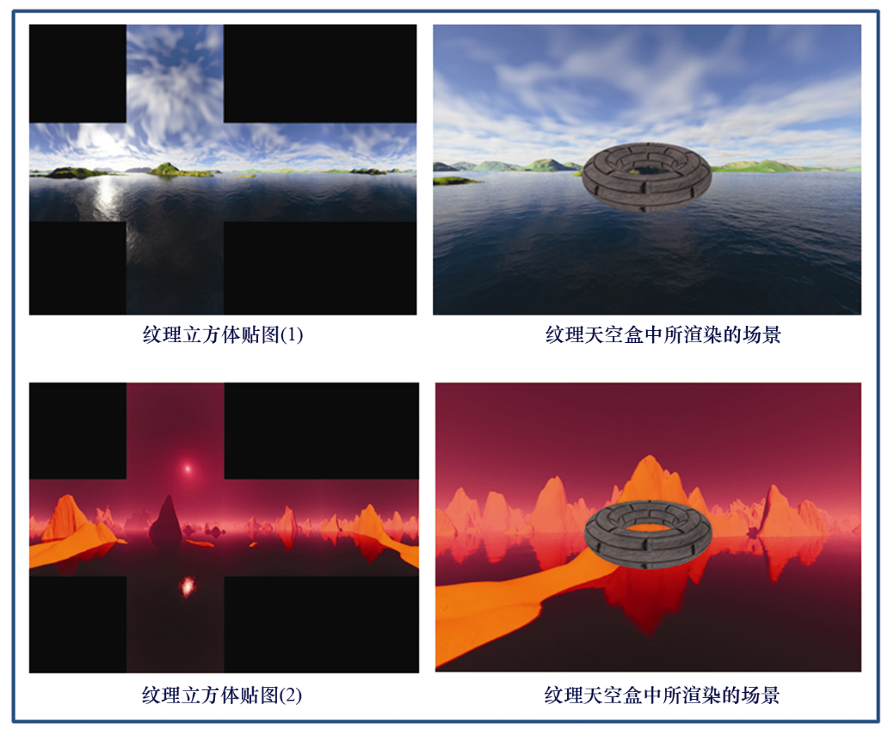
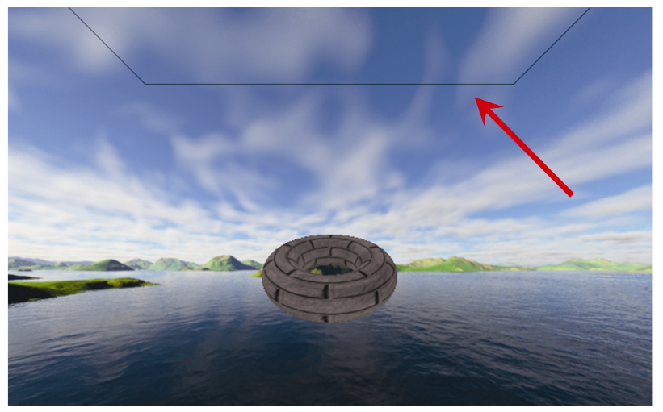

### 9.3.1　从头开始构建天空盒

我们已经涵盖了构建简单天空盒所需的几乎所有内容。第4章介绍了立方体模型；分配纹理坐标已经在本章前面图9.3中进行了展示；使用SOIL2库读取纹理以及在3D空间中放置对象也都已经在之前的章节进行过讲解。这里，我们将看到如何简单地启用和禁用深度测试（只需要一行代码）。

程序9.1展示了简单天空盒的代码结构，场景中仅包含一个带纹理的环面。纹理坐标分配和启用/禁用深度测试的调用已突出显示。

程序9.1　简单的天空盒

```c
C++/OpenGL应用程序
//所有变量声明，构造函数和init()与之前相同
. . .
void display(GLFWwindow* window, double currentTime) { 
   // 清除颜色缓冲区和深度缓冲区，并像之前一样创建投影视图矩阵和摄像机视图矩阵
   . . . 
   glUseProgram(renderingProgram); 
   // 准备首先绘制天空盒。M矩阵将天空盒放置在摄像机位置
   mMat = glm::translate(glm::mat4(1.0f), glm::vec3(cameraX, cameraY, cameraZ));
   // 构建MODEL-VIEW矩阵
   mvMat = vMat * mMat; 
   // 如前，将MV和PROJ矩阵放入统一变量
   . . . 
   // 设置包含顶点的缓冲区
   glBindBuffer(GL_ARRAY_BUFFER, vbo[0]); 
   glVertexAttribPointer(0,3, GL_FLOAT, GL_FALSE, 0, 0); 
   glEnableVertexAttribArray(0); 
   // 设置包含纹理坐标的缓冲区
   glBindBuffer(GL_ARRAY_BUFFER, vbo[1]); 
   glVertexAttribPointer(1,2, GL_FLOAT, GL_FALSE, 0, 0); 
   glEnableVertexAttribArray(1); 
   //激活天空盒纹理
   glActiveTexture(GL_TEXTURE0); 
   glBindTexture(GL_TEXTURE_2D, skyboxTexture); 
   glEnable(GL_CULL_FACE); 
   glFrontFace(GL_CCW);    // 立方体缠绕顺序是顺时针的，但我们从内部查看，因此使用逆时针缠绕顺序GL_CCW
   glDisable(GL_DEPTH_TEST);    glDrawArrays(GL_TRIANGLES, 0, 36);       // 在没有深度测试的情况下绘制天空盒
   glEnable(GL_DEPTH_TEST);
   //现在像之前一样绘制场景中的对象
   . . . 
   glDrawElements( . . . );    //和之前的场景中的对象一样
}
void setupVertices(void) { 
   // cube_vertices定义与之前相同
   // 天空盒的立方体纹理坐标，如图9.3所示
   float cubeTextureCoord[72] = {       1.00f, 0.66f, 1.00f, 0.33f, 0.75f, 0.33f,    // 背面右下角
      0.75f, 0.33f, 0.75f, 0.66f, 1.00f, 0.66f,    // 背面左上角
      0.75f, 0.33f, 0.50f, 0.33f, 0.75f, 0.66f,    // 右面右下角
      0.50f, 0.33f, 0.50f, 0.66f, 0.75f, 0.66f,    // 右面左上角
      0.50f, 0.33f, 0.25f, 0.33f, 0.50f, 0.66f,    // 正面右下角
      0.25f, 0.33f, 0.25f, 0.66f, 0.50f, 0.66f,    // 正面左上角
      0.25f, 0.33f, 0.00f, 0.33f, 0.25f, 0.66f,    // 左面右下角
      0.00f, 0.33f, 0.00f, 0.66f, 0.25f, 0.66f,    // 左面左上角
      0.25f, 0.33f, 0.50f, 0.33f, 0.50f, 0.00f,    // 下面右下角
      0.50f, 0.00f, 0.25f, 0.00f, 0.25f, 0.33f,    // 下面左上角
      0.25f, 1.00f, 0.50f, 1.00f, 0.50f, 0.66f,    // 上面右下角
      0.50f, 0.66f, 0.25f, 0.66f, 0.25f, 1.00f     // 上面左上角
   };    //像往常一样为立方体和场景对象设置缓冲区
}
//用于加载着色器、纹理、main()等的模块，如前

```

标准纹理着色器现在用于场景中的所有对象，包括立方体贴图：

```c
顶点着色器
#version 430
layout (location = 0) in vec3 position;
layout (location = 1) in vec2 tex_coord;
out vec2 tc;
uniform mat4 mv_matrix;
uniform mat4 proj_matrix;
layout (binding = 0) uniform sampler2D s;
void main(void)
{ tc = tex_coord;
  gl_Position = proj_matrix * mv_matrix * vec4(position,1.0);
}
片段着色器
#version 430
in vec2 tc;
out vec4 fragColor;
uniform mat4 mv_matrix;
uniform mat4 proj_matrix;
layout (binding = 0) uniform sampler2D s;
void main(void)
{ fragColor = texture(s,tc);
}
```

程序9.1的输出如图9.7所示，包括两个不同立方体贴图纹理以及各自的渲染结果。


<center class="my_markdown"><b class="my_markdown">图9.7　简单天空盒渲染结果</b></center>

如前所述，天空盒容易受到图像畸变和接缝的影响。接缝指两个纹理图像接触的地方（比如沿着立方体的边缘）有时出现的可见线条。图9.8展示了一个图像上半部分出现接缝的示例，它是运行程序9.1时出现的伪影。为了避免接缝，需要仔细构建立方体贴图图像，并分配精确的纹理坐标。有一些工具可以用来沿图像边缘减少接缝（例如<sup class="my_markdown">[GI16]</sup>），不过这个主题超出了本书的范围。


<center class="my_markdown"><b class="my_markdown">图9.8　天空盒“接缝”伪影</b></center>

