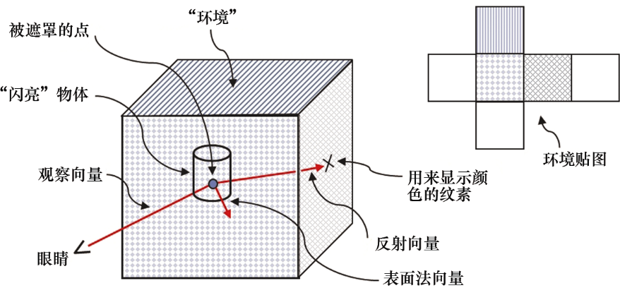
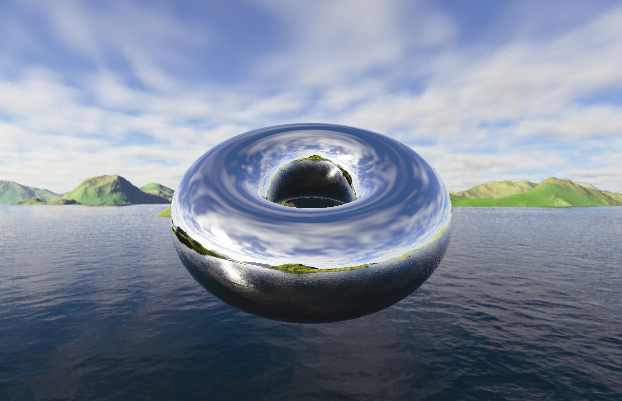

### 9.4　环境贴图

在照明和材质章节中，我们考虑了物体的“光泽”。然而，我们从未对非常闪亮的物体进行建模，例如镜子或铬制品。这些物体在有小范围镜面高光的同时，还能够反射出周围物体的镜像。当我们看向这些物品时，我们会看到房间里的其他东西，有时甚至会看到我们自己的倒影。ADS照明模型并没有提供模拟这种效果的方法。

不过，纹理立方体贴图提供了一种相对简单的方法来模拟（至少部分模拟）反射表面。其诀窍是使用立方体贴图来构造反射对象本身。<sup class="my_markdown">[1]</sup>如果想要做得看起来真实，则需要找我们从物体上看到的周围环境所对应的纹理坐标。

图9.9展示了使用视图向量和法向量组合计算反射向量的策略，之后，该反射向量会用来从立方体贴图中查找纹素。因此，反射向量可用来直接访问纹理立方体贴图。当立方体贴图用于上述功能时，称其为环境贴图。


<center class="my_markdown"><b class="my_markdown">图9.9　环境贴图总览</b></center>

我们在之前研究Blinn-Phong照明时计算过反射向量。除了我们现在使用反射向量从纹理贴图中查找值，这里的反射向量概念和之前类似。这种技术称为环境贴图或反射贴图。如果使用我们描述的第二种方法（在9.3.2小节中，使用OpenGL GL_TEXTURE_CUBE_MAP）实现立方体贴图，那么OpenGL可以使用与之前为立方体添加纹理相同的方法来进行环境贴图查找。我们使用视图向量和曲面法向量计算视图向量对应的离开对象表面的反射向量。然后可以使用反射向量直接对纹理立方体贴图图像进行采样。查找过程由OpenGL samplerCube辅助实现；回忆上一节中，samplerCube使用视图方向向量索引。因此，反射向量非常适用于查找所需的纹素。

实现环境贴图需要添加相对少量的代码。程序9.3展示了display()函数和init()函数以及相关着色器中的更改，以使用环境贴图渲染“反射”环面。所有更改都已经高亮显示。值得注意的是，如果使用了Blinn-Phong照明，那么很多需要添加的代码可能已经存在了。真正新的代码部分在片段着色器中[在main()函数中]。

乍一看程序9.3中突出显示的代码好像并不是新代码。实际上，在我们研究照明的时候，已经看到过几乎相同的代码。然而，在当前情况下，法向量和反射向量用于完全不同的目的。在之前的代码中，它们用于实现ADS照明模型。而在这里，它们用于计算环境贴图的纹理坐标。因此，我们将部分代码高亮，以便读者可以更轻松地追踪法向量和反射向量计算的使用，以实现这一新目的。

渲染的结果会显示使用了环境贴图的“铬制”环面，如图9.10所示（见彩插）。


<center class="my_markdown"><b class="my_markdown">图9.10　用于创建反射环面的环境贴图示例</b></center>

程序9.3　环境贴图

```c
void display(GLFWwindow* window, double currentTime) {
   // 用来绘制立方体贴图的代码未改变
   . . .
   // 所有修改都在绘制环面的部分
   glUseProgram(renderingProgram);
   // 矩阵变换的统一变量位置，包括法向量的变换
   mvLloc = glGetUniformLocation(renderingProgram, "mv_matrix");
   projLoc = glGetUniformLocation(renderingProgram, "proj_matrix");
   nLoc = glGetUniformLocation(renderingProgram, "norm_matrix");
   // 构建MODEL矩阵，如前
   mMat = glm::translate(glm::mat4(1.0f), glm::vec3(torLocX, torLocY, torLocZ));
   // 构建MODEL-VIEW矩阵，如前
   mvMat = vMat * mMat;
   invTrMat = glm::transpose(glm::inverse(mvMat));
   // 法向量变换现在在统一变量中
   glUniformMatrix4fv(mvLoc, 1, GL_FALSE, glm::value_ptr(mvMat));
   glUniformMatrix4fv(projLoc, 1, GL_FALSE, glm::value_ptr(pMat));
   glUniformMatrix4fv(nLoc, 1, GL_FALSE , glm::value_ptr(invTrMat));
   // 激活环面顶点缓冲区，如前
   glBindBuffer(GL_ARRAY_BUFFER, vbo[1]);
   glVertexAttribPointer(0, 3, GL_FLOAT, GL_FALSE, 0, 0);
   glEnableVertexAttribArray(0);
   // 我们需要激活环面法向量缓冲区
   glBindBuffer(GL_ARRAY_BUFFER, vbo[2]);    glVertexAttribPointer(1, 3, GL_FLOAT, GL_FALSE, 0, 0);    glEnableVertexAttribArray(1);
   // 环面纹理现在是立方体贴图
   glActiveTexture(GL_TEXTURE0);    glBindTexture(GL_TEXTURE_CUBE_MAP, skyboxTexture);
   // 绘制环面的过程未做更改
   glClear(GL_DEPTH_BUFFER_BIT);
   glEnable(GL_CULL_FACE);
   glFrontFace(GL_CCW);
   glDepthFunc(GL_LEQUAL);
   glBindBuffer(GL_ELEMENT_ARRAY_BUFFER, vbo[3]);
   glDrawElements(GL_TRIANGLES, numTorusIndices, GL_UNSIGNED_INT, 0);
}
顶点着色器
#version 430
layout (location = 0) in vec3 position;
layout (location = 1) in vec3 normal; out vec3 varyingNormal; out vec3 varyingVertPos; uniform mat4 mv_matrix;
uniform mat4 proj_matrix;
uniform mat4 norm_matrix; layout (binding = 0) uniform samplerCube tex_map;
void main(void)
{ varyingVertPos = (mv_matrix * vec4(position,1.0)).xyz;
  varyingNormal = (norm_matrix * vec4(normal,1.0)).xyz;   gl_Position = proj_matrix * mv_matrix * vec4(position,1.0);
}
片段着色器
#version 430
in vec3 varyingNormal; in vec3 varyingVertPos; out vec4 fragColor;
uniform mat4 mv_matrix;
uniform mat4 proj_matrix;
uniform mat4 norm_matrix; layout (binding = 0) uniform samplerCube tex_map;
void main(void)
{ vec3 r = -reflect(normalize(-varyingVertPos), normalize(varyingNormal));
  fragColor = texture(tex_map, r); }

```

虽然该场景需要两组着色器—— 一组用于立方体贴图，另一组用于环面——但是程序9.3中仅展示了用于绘制环面的着色器。这是因为用于渲染立方体贴图的着色器与程序9.2中的相同。通过对程序9.2的修改得到程序9.3的过程，总结如下。

在init()函数中：

+ 创建环面的法向量缓冲区[实际上在setupVertices()中完成，由init()调用]；
+ 不再需要环面的纹理坐标缓冲区。

在display()函数中：

+ 创建用于变换法向量的矩阵（在第7章中称为“norm_matrix”）并将其连接到关联的统一变量；
+ 激活环面法向量缓冲区；
+ 激活纹理立方体贴图为环面的纹理（而非之前的“砖”纹理）。

在顶点着色器中：

+ 将法向量和norm_matrix相加；
+ 输出变换的顶点和法向量以备计算反射向量，与在照明和阴影章节中所做的相似。

在片段着色器中：

+ 以与照明章节中相似的方式计算反射向量；
+ 从纹理（现在是立方体贴图）检索输出颜色，使用反射向量而非纹理坐标进行查找。

图9.10中显示的渲染结果是一个很好的例子，展示了通过简单的技巧能够实现强大的幻觉。通过在对象上简单地绘制背景，我们使对象看起来有“金属质感”，而根本没有进行ADS材质建模。即使没有任何ADS照明被整合到场景中，这种技巧也能让人感觉光从物体反射出来。在这个例子中，我们甚至会感到在环面的左下方似乎有一个镜面高光，因为立方体贴图中包括太阳在水中反射的倒影。

