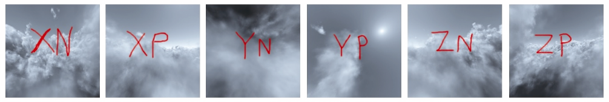

### 习题

9.1　（项目）在程序9.2中，添加使用鼠标或键盘移动相机的功能。为此，你需要使用先前在习题4.2中开发的代码来构建视图矩阵。还要为前后移动以及绕各轴旋转相机的功能分配鼠标或键盘操作（你需要编写这些函数）。完成这些操作后，你应该能够在场景中“飞来飞去”，并能够注意到天空盒始终看起来保持在遥远的地平线上。

9.2　在6个立方体贴图图像文件上绘制标签，以确认实现中使用了正确的方向。例如，你可以在图像上绘制轴标签，如图9.11所示。

<b class="my_markdown">图9.11　6个立方体贴图</b>

还可以使用“带标记的”立方体贴图来验证环境贴图环面中的反射是否正确呈现。

9.3　（项目）向程序9.3添加动画，以便场景中的一个（或多个）使用了环境贴图的对象旋转或翻转。当天空盒纹理在物体表面上移动时，物体的模拟反射性质会更明显。

9.4　（项目）修改程序9.3，以使场景中的对象将环境贴图与纹理混合。在片段着色器中加权求和，如第7章中所述。

9.5　（研究和项目）了解使用Terragen [TE16]创建简单立方体贴图的基础知识。通常需要（在Terragen中）制作具有所需地形和大气模式的“世界”，然后将Terragen的合成相机放置在前、后、右、左、顶部和底部以保存作为各视图的6个图像。在程序9.2和程序9.3中使用新生成的图像，观察它们作为立方体贴图和环境贴图呈现的外观。使用Terragen的免费版本足以进行此练习。

