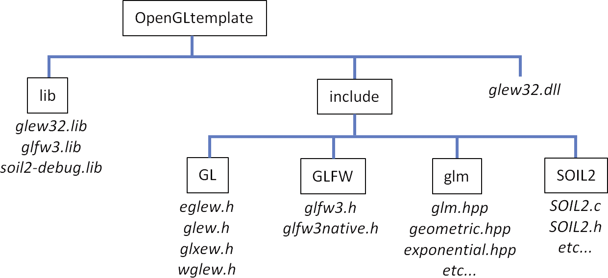

### A.1.7　准备共享的“lib”和“include”文件夹

选择你要存放库文件的位置。你可以随意选择任何文件夹；例如，你可以创建一个文件夹“C:\ OpenGLtemplate”。在该文件夹中，创建名为“lib”和“include”的子文件夹。

+ 在“lib”文件夹中，放置glew32.lib和glfw3.lib。
+ 在“include”文件夹中，放置前面描述的GL、GLFW和glm文件夹。
+ 导航回SOIL2文件夹，进入其中的“lib”文件夹。将“soil2-debug.lib”文件复制到“lib”文件夹（glew32.lib和glfw3.lib所在的文件夹）。
+ 导航回SOIL2文件夹，然后导航到“src”。将“SOIL2”文件夹复制到“include”文件夹（GL、GLFW和GLM所在的文件夹）。此SOIL2文件夹包含soil2的.c和.h文件。
+ 你可能会发现将“glew32.dll”文件放在此“OpenGLtemplate”文件夹中也很方便，这样你就可以知道在哪里找到它——尽管这不是必要的。

文件夹结构现在应该如图A.1所示。

<b class="my_markdown">图A.1　建议的库文件夹结构</b>

