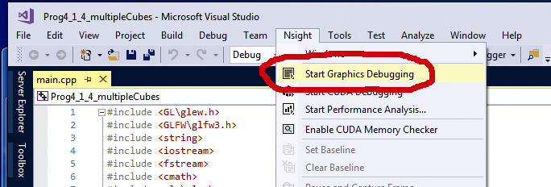
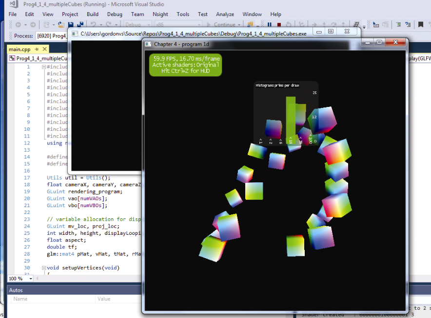
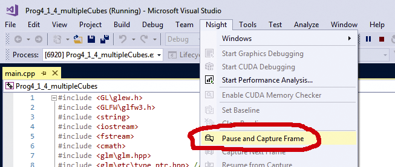
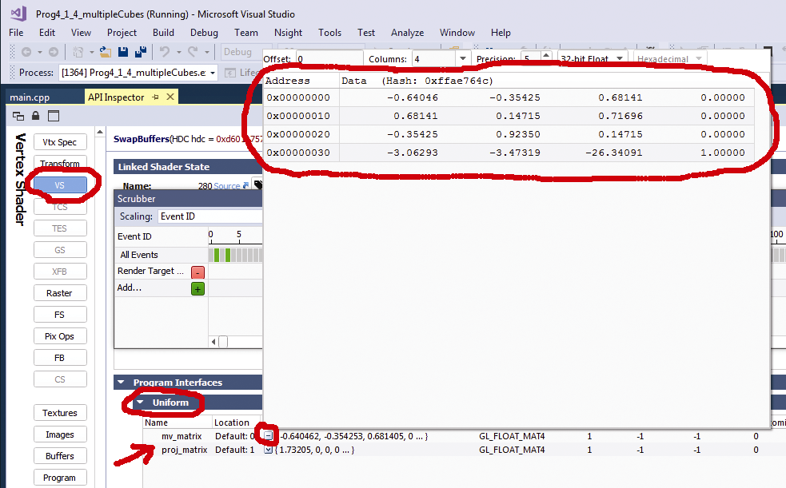
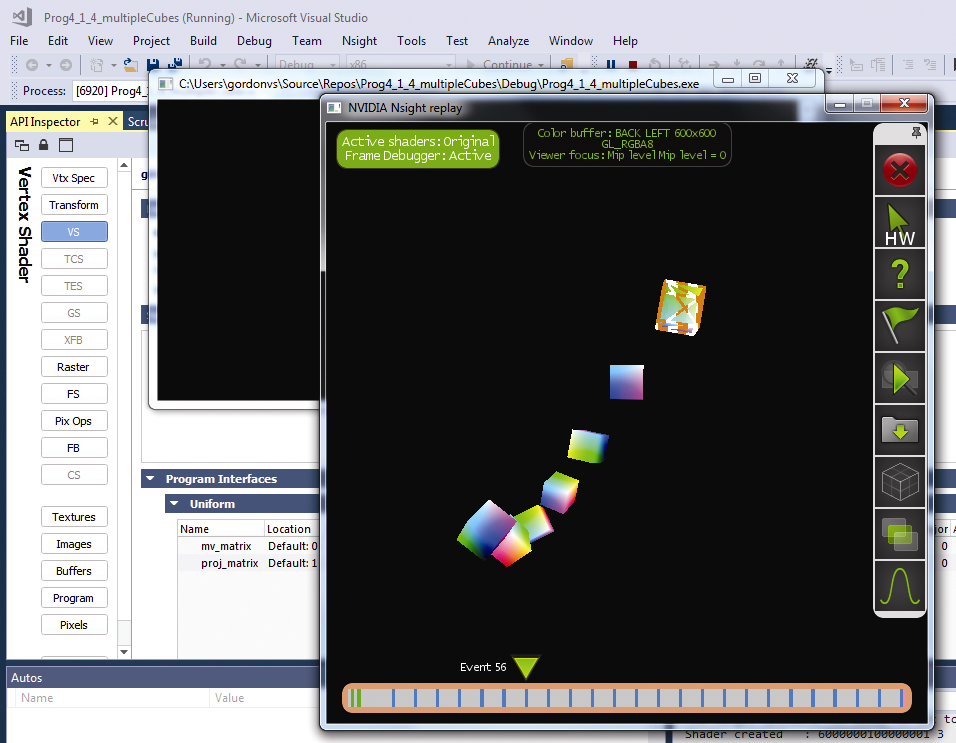

### C.3　在Nsight中运行C++/OpenGL应用程序

（1）在“Nsight”菜单下（沿顶部菜单栏），选择“Start Graphics Debugging”，如图C.1所示。

<b class="my_markdown">图C.1　选择“Start Graphics Debugging”</b>

（2）单击后，将弹出一个窗口，询问您是否要“connect without security？”（无安全地连接？），单击“Connect unsecurely”（不安全连接）。这将会启动C++ / OpenGL图形程序。你将会看到终端窗口和正在运行的程序。Nsight可能会在运行的程序中叠加一些信息，如图C.2所示。

<b class="my_markdown">图C.2　启动C++ / OpenGL图形程序</b>

（3）当程序开始运行后，与任意希望检查的部分互动，之后，在Nsight菜单中，单击“Pause and Capture Frame”（暂停并捕获当前帧），如图C.3所示。

<b class="my_markdown">图C.3　暂停并捕获当前帧</b>

（4）接下来帧调试器界面会出现，同时出现的还有一个HUD工具栏和称为“scrubber”的水平选择工具。此程序在这里应该会暂停。在调试器屏幕的核心是左边的工具栏，其中有每个着色器阶段对应的按钮。例如，你可以单击高亮“VS”（顶点着色器），之后在右侧的界面中，你可以向下滚动并查看统一变量的内容（假设你在上方选择了“API inspector”，API检查器）。在图C.4中，“mv_matrix”右侧的小方框已打开，显示4×4 MV矩阵的内容。

<b class="my_markdown">图C.4　显示4×4 MV矩阵</b>

（5）出现的另一个有趣的窗口看起来类似于正在运行的程序。此窗口底部有一个时间轴，你可以单击并查看当前帧中绘制的项目的顺序。图C.5是一个示例——注意在时间轴的左侧区域单击光标，窗口中显示了那些到该时间点为止已经绘制出的项目。

<b class="my_markdown">图C.5　当前帧中绘制的项目顺序</b>

有关如何充分利用Nsight工具的详细信息，请参阅Nsight文档。

