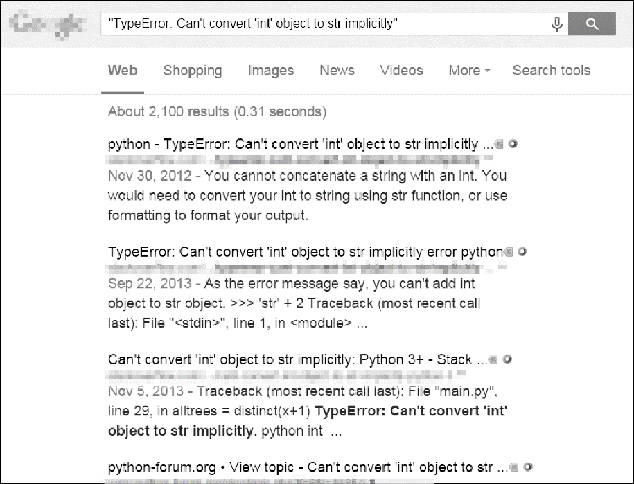

# 前　言

“你在两小时里完成的事，我们3个人要做两天。”21世纪早期，我的大学室友在一个电子产品零售商店工作。商店偶尔会处理一份电子表格，其中包含来自其他商店的数千种产品的价格。由3个员工组成的团队，会将这份电子表格打印在一叠厚厚的纸上，然后3个人分别处理一部分。针对每种产品，他们会查看自己商店的价格，并找出售价更低的所有竞争对手。这通常会花几天的时间。

“如果你有打印件的原始文件，我会写一个程序来做这件事。”我的室友告诉他们，当时他看到他们坐在地板上，周围都是散落、堆叠的纸张。

几小时后，他写了一个简短的程序，从文件中读取竞争对手的价格，在商店的数据库中找到相应产品，并记录竞争对手的价格是否更便宜。他当时还是编程新手，花了许多时间在一本编程书中查看文档。实际上程序运行只花了几秒时间。我的室友和他的同事们那天享受了超长的午餐时间。

这就是计算机编程的威力。计算机就像瑞士军刀，可以用来完成数不清的任务。许多人花上数小时单击鼠标和敲打键盘，执行重复的任务，却没有意识到，如果他们给机器正确的指令，机器就能在几秒内完成他们的工作。

## 本书的读者对象

软件是我们今天使用的许多工具的核心：几乎每个人使用社交网络进行交流，许多人有连接因特网的计算机，大多数办公室工作需要操作计算机来完成。因此，现在社会对编程人才的需求暴涨。无数的图书、交互式网络教程和开发者新兵训练营承诺将有雄心壮志的初学者变成软件工程师，让他们获得6位数的薪水。

本书不是针对这些人的，而是针对所有其他的人。

就本书来说，它不会让你变成一个职业软件开发者，就像学习几节吉他课程不会让你变成一名摇滚明星一样。但如果你是办公室职员、管理者、学术研究者，或其他任何使用计算机来工作或娱乐的人，通过本书，你将学到编程的基本知识，这样就能将下面这些简单的任务自动化。

+ 移动并重命名几千个文件，将它们分类，并放入文件夹。
+ 填写在线表单，但不需要打字。
+ 在网站更新时，从网站下载文件或复制文本。
+ 让计算机向客户发出短信通知。
+ 更新或格式化Excel电子表格。
+ 检查电子邮件并发出预先写好的回复。

对人来说，这些任务简单，但很花时间。它们通常很琐碎、很特殊，没有现成的软件可以完成。但是，拥有一点编程知识，就可以让计算机为你完成这些任务。

## 编程规范

本书没有设计成参考手册，它是初学者指南。编程风格有时候违反最佳实践（例如有些程序使用全局变量），但这是一种折中方式，可以让代码更简单，以便学习。本书的目的是让人们编写用完即抛弃的代码，所以不用花太多时间来关注风格和优雅。复杂的编程概念（如面向对象编程、列表推导和生成器）在本书中也没有出现，因为它们增加了复杂性。编程老手可能会指出，本书中的代码可以修改得更有效率，但本书主要考虑的是用最少的工作量得到能工作的程序。

## 什么是编程

在电视剧和电影中，我们常常看到程序员在闪光的屏幕前迅速地输入密码般的一串1和0，但现代编程没有这么神秘。“编程”就是输入指令让计算机来执行。这些指令可能用于运算一些数字、修改文本、在文件中查找信息，或通过因特网与其他计算机通信。

所有程序都使用基本指令作为构件块。下面是一些常用的指令，是用自然语言的形式表示的。

+ “做这个，然后做那个。”
+ “如果这个条件为真，执行这个动作；否则，执行那个动作。”
+ “按照指定次数执行这个动作。”
+ “一直做这个，直到条件为真。”

你也可以组合这些构件块，以实现更复杂的功能。例如，下列所示的是一些编程指令，称为“源代码”，是用Python编程语言编写的一个简单程序。Python软件从头开始执行每行代码（有些代码只有在特定条件为真时才执行，为假时Python会执行另外一些代码），直到代码结束。

```javascript
❶ passwordFile = open('SecretPasswordFile.txt')
❷ secretPassword = passwordFile.read()
❸ print('Enter your password.')
  typedPassword = input()  
❹ if typedPassword == secretPassword:
    ❺ print('Access granted')
    ❻ if typedPassword == '12345':
        ❼ print('That password is one that an idiot puts on their luggage.')
  else:
   ❽ print('Access denied')
```

你可能对编程一无所知，但读了上面的代码，也许就能够猜测它做的事了。首先，打开了文件SecretPasswordFile.txt❶，读取了其中的口令❷。然后，提示用户（通过键盘）输入一个口令❸。比较这两个口令❹，如果它们一样，程序就在屏幕上输出Access granted❺。接下来，程序检查口令是否为12345❻，提示说这可能并不是最好的口令❼。如果口令不一样，程序就在屏幕上输出Access denied❽。

### 什么是Python

Python指的是Python编程语言（包括语法规则，用于编写被认为是有效的Python代码）；也指Python解释器软件，它读取源代码（用Python语言编写），并执行其中的指令。Python解释器可以从Python的官方网站免费下载，有针对Linux操作系统、macOS和Windows操作系统的版本。

Python的名字来自超现实主义的英国喜剧团体，而不是来自蛇。Python程序员被亲切地称为Pythonistas。Monty Python和与蛇相关的引用常常出现在Python的指南和文档中。

### 程序员不需要知道太多数学知识

我听到的关于学习编程的最常见的顾虑，就是人们认为这需要很多数学知识。其实，大多数编程需要的数学知识不外乎基本算术运算。实际上，善于编程与善于解决数独问题没有太大差别。

要解决数独问题，数字1～9必须填入9×9棋盘的每一行、每一列，以及每个3×3的内部方块。系统提供了一些数字来帮助你开始，然后你可以根据这些数字进行推算，从而找到答案。例如，在图 0-1的数独问题中，既然5出现在了第1行和第2行，它就不能在这些行中再次出现。因此，在右上角的3×3方块中，它必定在第3行；由于整个网格的最后一列已有了5，所以在右上角的3×3方块中，5就不能在6的右边。每次解决一行、一列或一个方块，将为剩下的部分提供更多的数字线索。随着你填入一组数字1～9，然后再填写另一组数字，整个网格很快就会被填满。


<center class="my_markdown"><b class="my_markdown">图0-1　一个新的数独问题（左边）及其答案（右边）。尽管使用了数字，
 但数独并不需要太多数学知识</b></center>

数独虽然使用了数字，但并不意味着必须精通数学才能求出答案。编程也是这样。就像解决数独问题一样，编程需要将一个问题分解为单个的、详细的步骤。类似地，在“调试”程序（即寻找和修复错误）时，你会耐心地观察程序在做什么，找出出现错误的原因。像所有技能一样，编写的程序越多，你掌握得就越好。

### 你还没有老到不能学习编程

我听到的关于编程的第二常见的焦虑是，认为自己太老了，无法学习编程。我见到许多人在网上发表了评论，他们认为编程对自己来说为时已晚，因为他们已经23岁了。显然，这并不是因太“老”而无法学习编程：许多人在晚年生活也能学到很多东西。

要成为一名有能力的程序员，你不需要从小就开始。但是，程序员像神童一般的形象反复出现。不幸的是，当我告诉别人我从小学就开始编程时，我也为这个神话做出了贡献。

但是，如今的编程比20世纪90年代更容易学习。今天，有更多的书、更好的搜索引擎以及更多的在线问答网站。最重要的是，编程语言本身更加易于使用。由于这些原因，现在大约用12个周末，就可以了解我从小学到高中毕业学到的编程知识。我领先得并不是太多。

对编程抱有“成长心态”很重要，换言之，要明白人们是通过实践来培养编程技能的。他们不是生来就是程序员，现在不具备编程技能，并不表示永远无法成为专家。

### 编程是创造性活动

编程是一项创造性活动，就像绘画、写作、编织或用积木构建一个城堡。就像在一张空白画布上绘画，制作软件虽然有许多限制，但有无限的可能。

编程与其他创造性活动的不同之处在于，在编程时，你需要的所有原材料都在计算机中，你不需要购买额外的画布、颜料、胶片、纱线、积木或电子器件等。一台10年前的老旧计算机，对于编写程序来说已经足够强大，绰绰有余。在程序写好后，它可以被完美地复制无数次。编织的毛衣一次只能给一个人穿，但有用的程序很容易在线分享给整个世界。

## 本书简介

本书的第一部分介绍Python的基本编程概念；第二部分介绍一些不同的任务，你可以让计算机自动完成它们。第二部分的每一章都有一些项目程序，供你学习。下面简单介绍一下每章的内容。

**第一部分：Python编程基础**

“第 1 章　Python基础”介绍表达式、Python指令的最基本类型，以及如何使用Python交互式环境来尝试运行代码。

“第 2 章　控制流”解释如何让程序决定执行哪些指令，以便代码能够智能地响应不同的情况。

“第 3 章　函数”介绍如何定义自己的函数，以便将代码组织成可管理的部分。

“第4章　列表”介绍列表数据类型，解释如何组织数据。

“第 5 章　字典和结构化数据”介绍字典数据类型，展示更强大的数据组织方法。

“第6章　字符串操作”介绍处理文本数据（在Python中称为“字符串”）的方法。

**第二部分：自动化任务**

“第7章　模式匹配与正则表达式”介绍Python如何用正则表达式处理字符串，以及查找文本模式。

“第 8 章　输入验证”解释程序如何验证用户提供的信息，确保用户数据到达时的格式不会在程序的其余部分引起错误。

“第 9 章　读写文件”解释程序如何读取文本文件的内容，并将信息保存到硬盘的文件中。

“第10 章　组织文件”展示Python如何用比手动操作快得多的速度复制、移动、重命名和删除大量的文件，也解释如何用Python压缩和解压缩文件。

“第11章　调试”展示如何使用Python的bug查找和bug修复工具。

“第 12 章　从Web抓取信息”展示如何通过编程来自动下载网页，并解析它们，获取信息。

“第 13 章　处理Excel电子表格”介绍通过编程处理Excel电子表格的方法。如果你分析的文档很少，那么你不必阅读本章。如果你必须分析成百上千的文档，这章知识是很有帮助的。

“第14章　处理Google电子表格”介绍如何使用Python读取和更新Google表格（一种流行的基于Web的电子表格应用程序）。

“第15章　处理PDF和Word文档”介绍通过编程处理PDF和Word文档的方法。

“第16章　处理 CSV 文件和 JSON 数据”解释如何编程处理 CSV 文件和JSON数据。

“第17章　保持时间、计划任务和启动程序”解释Python程序如何处理时间和日期，如何安排计算机在特定时间内执行任务。这一章也展示Python程序如何启动非Python程序。

“第18章　发送电子邮件和短信”解释如何通过编程来发送电子邮件和短信。

“第19章　操作图像”解释如何通过编程来操作JPG或PNG等格式的图像。

“第20章　用GUI自动化控制键盘和鼠标”解释如何通过编程控制鼠标和键盘，自动化鼠标点击和按键。

“附录A　安装第三方模块”展示如何利用有用的附加模块来扩展Python。

“附录 B　运行程序”展示如何在代码编辑器之外，在Windows操作系统、macOS和Ubuntu Linux操作系统上运行Python程序。

## 下载和安装Python

可以从Python的官方网站免费下载针对Windows操作系统、macOS和Ubuntu Linux操作系统的Python版本。如果你从该网站的下载页面下载了最新的版本，那么本书中的所有程序应该都能工作。


**警告：**
请确保下载Python 3的版本（如3.8.0）。本书中的程序将运行在Python 3上，有一部分程序在Python 2上也许不能正常运行。


你需要在下载页面上找到针对64位或32位计算机以及特定操作系统的Python安装程序，所以先要弄清楚你需要哪个安装程序。如果你的计算机是2007年及以后购买的，很有可能是64位的系统；否则，可能是32位的系统，下面是确认的方法。

+ 在Windows操作系统上，选择开始 **▶** 控制面板 **▶** 系统。检查系统类型是64位还是32位。
+ 在macOS上，进入Apple菜单，选择About This Mac▶MoreInfo▶SystemReport▶ Hardware，然后查看Processor Name字段。如果是Intel Core Solo或Intel Core Duo，则机器是32位的；如果是其他（包括Intel Core 2 Duo），则机器是64位的。
+ 在Ubuntu Linux操作系统上，打开命令行窗口，运行命令 `uname -m` 。结果是i686表示32位，x86_64表示64位。

在Windows操作系统上，下载Python安装程序（文件扩展名是.msi），并双击它。按照安装程序显示在屏幕上的指令来安装Python，步骤如下。

1．选择Install for All Users，然后单击Next。

2．在接下来的几个窗口中，依次单击Next，接受默认选项。

在macOS上，下载适合你的macOS版本的.dmg文件，并双击它。按照安装程序显示在屏幕上的指令来安装Python，步骤如下。

1．当DMG包在一个新窗口中打开时，双击Python.mpkg文件。你可能必须输入管理员口令。

2．单击Continue，跳过欢迎部分，并单击Agree，接受许可证。

3．在最后的窗口中，单击Install。

如果使用的是Ubuntu Linux操作系统，可以从命令行窗口安装Python，步骤如下。

1．打开命令行窗口。

2．输入 `sudo apt-get install python3` 。

3．输入 `sudo apt-get install idle3` 。

4．输入 `sudo apt-get install python3-pip` 。

## 下载和安装Mu

“Python解释器”是运行Python程序的软件，而“Mu编辑器软件”则是你输入程序的地方，这与你在文字处理器中输入内容的方式非常相似。

在Windows操作系统和macOS上下载适合你的操作系统的安装程序，然后通过双击安装程序文件来运行它。如果你使用的是macOS，那么运行安装程序时会打开一个窗口，你必须在其中将Mu图标拖动到Applications文件夹中才能继续安装。如果你使用的是Ubuntu Linux操作系统，那么需要将Mu安装为Python软件包。在这种情况下，请单击下载页面“Python Package”部分中的Instructions按钮。

## 启动Mu

安装完成后，让我们启动 `Mu` 。

+ 在Windows 7操作系统或更高版本上，单击屏幕左下角的开始图标，在搜索框中输入Mu，然后选择它。
+ 在macOS上，打开Finder窗口，单击“应用程序”（Applications），然后单击mu-editor。
+ 在Ubuntu Linux操作系统上，选择Applications▶Accessories▶Terminal，然后输入 `python3 –m mu` 。

第一次运行Mu时，屏幕将显示一个“Select Mode”（选择模式）窗口，其中包含选项Adafruit CircuitPython、BBC micro:bit、Pygame Zero和Python 3。选择Python 3。以后，你就可以通过单击编辑器窗口顶部的Mode按钮来更改模式了。


**注意：**  你需要下载Mu 1.10.0版本或更高版本，这样才能安装本书介绍的第三方模块。在编写本书时，Mu 1.10.0是一个Alpha版本，在下载页面上作为单独链接列出，与主要下载链接分开。


## 启动IDLE

本书使用Mu作为编辑器和交互式环境。但是，你可以使用各种编辑器来编写Python代码。“集成开发和学习环境”（IDLE）软件与Python一起安装，如果出于某种原因，你不能安装Mu或让它工作，那么IDLE可以作为另一个编辑器。现在让我们启动IDLE。

+ 在Windows 7操作系统或更新的版本上，单击屏幕左下角的开始图标，在搜索框中输入 `IDLE` ，并选择IDLE（Python GUI）。
+ 在macOS上，打开Finder窗口，单击Applications，单击Python 3.8，然后单击IDLE的图标。
+ 在Ubuntu Linux操作系统上，选择Applications▶Accessories▶Terminal，然后输入 `idle3` （你也可以单击屏幕顶部的Applications，选择Programming，然后单击IDLE 3）。

## 交互式环境

运行Mu时，出现的窗口称为“文件编辑器”窗口。你可以通过单击REPL按钮打开“交互式环境”。该环境是一个程序，可以让你在计算机中输入指令，就像在macOS和Windows操作系统上各自的“终端”或“命令提示符”中输入一样。使用Python的交互式环境，你可以输入指令，让Python解释器软件运行它们。计算机将读取你输入的指令并立即运行它们。

在Mu中，交互式环境是窗口下半部分的窗格，其中包含以下文本：

```javascript
Jupyter QtConsole 4.3.1
Python 3.6.3 (v3.6.3:2c5fed8, Oct   3 2017, 18:11:49) [MSC v.1900 64 bit   
(AMD64)] 
Type 'copyright', 'credits' or 'license' for more information
IPython 6.2.1 -- An enhanced Interactive Python. Type '?' for help.
In[1]:
```

如果运行IDLE，则交互式环境是第一个出现的窗口。除了包含看起来像下面这样的文本外，大部分应该为空白：

```javascript
Python 3.8.0b1 (tags/v3.8.0b1:3b5deb0116, Jun   4 2019, 19:52:55) [MSC v.1916
64 bit (AMD64)] on win32
Type  "help",  "copyright",  "credits"  or  "license"  for  more  information. 
>>>
```

`In [1]:` 和>>>称为“提示符”。本书中的示例将用>>>提示符表示交互式环境，因为它更常见。如果你在命令行窗口中运行Python，它们也会使用>>>提示符。 `In [1]``:` 提示符是另一种流行的Python编辑器——Jupyter Notebook发明的。

例如，在交互式环境的提示符后输入以下指令：

```javascript
>>>  print('Hello, world!') 
```

在输入该行并按下回车键后，交互式环境将显示以下内容作为响应：

```javascript
>>>  print('Hello, world!') 
Hello, world! 
```

你刚刚给计算机提供了一条指令，它完成了你要执行的操作。

## 安装第三方模块

一些Python代码要求你的程序导入模块。其中一些模块是Python附带的，而有些模块是Python核心开发团队之外的开发人员创建的第三方模块。附录A详细说明了如何使用pip程序（在Windows操作系统上）或pip3程序（在macOS和Linux操作系统上）安装第三方模块。当本书要求你安装特定的第三方模块时，请查阅附录A。

## 如何寻求帮助

程序员喜欢通过在因特网上搜索问题的答案来学习。这不同于许多人习惯的学习方式，即通过一名亲自授课并可以回答问题的老师来进行学习。使用因特网作为教师的最大好处是，整个社区的人都可以回答你的问题。

实际上，你的问题可能已经有人回答了，答案已经在线，等待你找到它们。许多人都会遇到错误信息或代码无法正常工作的情况，你不会是第一个遇到这个问题的人，找到解决方案比你想象的要容易。

例如，让我们故意制造一个错误：在交互式环境中输入'42'　+ 3。你现在不需要了解这条指令的含义，但结果应如下所示：

```javascript
   >>> '42' + 3
❶ Traceback (most recent call last):
    File "", line 1, in 
      '42' + 3
❷ TypeError: Can't convert 'int' object to str implicitly
   >>>
```

这里出现了错误信息❷，因为Python不理解你的指令。错误信息的Traceback部分❶显示了Python遇到困难的特定指令和行号。如果你不知道怎样处理特定的错误信息，就在线查找那条错误信息。在你喜欢的搜索引擎上输入“ `TypeError: Can't convert 'int' object to str implicitly` ”（包括单引号），你就会看到许多的链接解释了这条错误信息的含义，以及什么原因导致这个错误，如图0-2所示。


<center class="my_markdown"><b class="my_markdown">图0-2　错误信息的搜索结果</b></center>

你常常会发现，别人也遇到了同样的问题，而其他乐于助人的人已经回答了这个问题。没有人知道编程的所有知识，因此所有软件开发者的日常工作之一都是在寻找技术问题的答案。

## 聪明地提出编程问题

如果不能在线查找到答案，请尝试在Stack Overflow或Reddit子板块“learn programming”这样的论坛上提问。但要记住用聪明的方式提出编程问题，这有助于别人来帮助你。确保阅读这些网站的常见问题（Frequently Asked Question，FAQ），了解正确的提问方式。

在提出编程问题时，要记住以下几点。

+ 说明你打算做什么，而不只是你做了什么。这会让帮助你的人知道你是否走错了路。
+ 明确指出发生错误的地方。指出它是在程序每次启动时发生，还是在你做了某些动作之后发生。
+ 将完整的错误信息和你的代码复制粘贴到Pastebin或GitHub Gist上。这些网站让你很容易地在网上与他人共享大量的代码，而不会丢失任何文本格式。然后你可以将贴出的代码的URL放在电子邮件或论坛帖子中。
+ 解释你为了解决这个问题已经尝试了哪些方法。这告诉别人你已经做了一些工作来弄清楚状况。
+ 列出你使用的Python版本（Python 2解释器和Python 3解释器之间有一些重要的区别）。而且，要说明你使用的操作系统和版本。
+ 如果错误在你更改了代码之后出现，准确说明你改了什么。
+ 说明是否在每次运行该程序时都会重现该错误；或者它只是在特定的操作执行之后才出现，如果是这样，解释是哪些操作。
+ 遵守良好的在线文明行为。例如，不要全用大写提问，或者对试图帮助你的人提出无理的要求。

## 小结

对于大多数人，他们的计算机只是设备，而不是工具。但通过学习编程，你就能利用现代社会中强大的工具，并且你会一直感到快乐。编程不是脑外科手术，业余人士是完全可以尝试和犯错的。

本书假定你编程的知识为零，并且会教给你很多知识，但你的问题可能超出本书的范围。记住如何有效地提问，如何寻找答案，这对于你的编程之旅是无价的。


