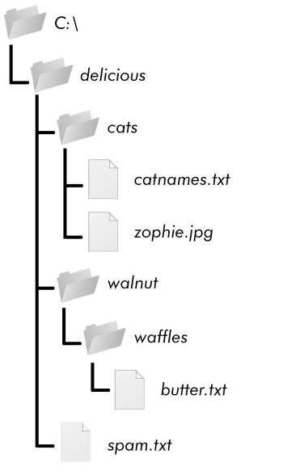

### 10.2　遍历目录树

假定你希望对某个文件夹中的所有文件进行重命名，包括该文件夹中所有子文件夹中的所有文件。也就是说，你希望遍历目录树，并处理遇到的每个文件。写程序完成这件事可能需要一些技巧，好在Python提供了一个函数可以替你处理这个过程。

请看C:\delicious文件夹及其内容，如图10-1所示。

这里有一个示例程序，针对图10-1所示的目录树，使用了 `os.walk()` 函数：

```javascript
import  os
for folderName, subfolders, filenames in os.walk('C:\\delicious'):
    print('The current folder is ' + folderName)
    for subfolder in subfolders:
        print('SUBFOLDER OF ' + folderName + ': ' + subfolder)
    for filename in filenames:
        print('FILE INSIDE ' + folderName + ': '+ filename)
    print('')
```


<center class="my_markdown"><b class="my_markdown">图10-1 一个示例文件夹，包含3个文件夹和4个文件</b></center>

`os.walk()` 函数被传入一个字符串值，即一个文件夹的路径。你可以在一个 `for` 循环语句中使用 `os.walk()` 函数遍历目录树，就像使用 `range()` 函数遍历某个范围的数字一样。不像 `range()` ， `os.walk()` 在循环的每次迭代中返回以下3个值。

+ 当前文件夹名称的字符串。
+ 当前文件夹中子文件夹的字符串的列表。
+ 当前文件夹中文件的字符串的列表。

所谓当前文件夹，是指 `for` 循环时迭代的文件夹。程序的当前工作目录不会因为 `os.walk()` 而改变。

就像你可以在代码 `for i in range(10):` 中选择变量名称 `i` 一样，你也可以选择前面列出来的 3 个变量名称。我通常使用 `foldername` 、 `subfolder` 和 `filename来表示它们` 。

运行该程序，它的输出结果如下：

```javascript
The current folder is C:\delicious
SUBFOLDER OF C:\delicious: cats
SUBFOLDER OF C:\delicious: walnut
FILE INSIDE C:\delicious: spam.txt
The current folder is C:\delicious\cats
FILE INSIDE C:\delicious\cats: catnames.txt
FILE INSIDE C:\delicious\cats: zophie.jpg
The current folder is C:\delicious\walnut
SUBFOLDER OF C:\delicious\walnut: waffles
The current folder is C:\delicious\walnut\waffles
FILE INSIDE C:\delicious\walnut\waffles: butter.txt.
```

因为 `os.walk()` 返回字符串的列表，并且将其保存在 `subfolder` 和 `filename` 变量中，所以你可以在它们自己的 `for` 循环中使用这些列表。用你自己编写的代码，取代 `print()` 函数调用（或者如果不需要，就删除 `for` 循环）。

