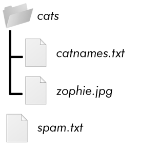

### 10.3　用zipfile模块压缩文件

你可能熟悉ZIP文件（带有.zip文件扩展名），它可以包含许多其他文件的压缩内容。压缩一个文件会减少它的大小，这在因特网上传输时很有用。因为一个ZIP文件可以包含多个文件和子文件夹，所以使用它是一种很方便的方式。将多个文件打包成一个文件，打包后的文件叫作“归档文件”，可以用作电子邮件的附件或其他用途。

利用 `zipfile` 模块中的函数，Python程序可以创建和打开（或解压）ZIP文件。假定你有一个名为example.zip的ZIP文件，它的内容如图10-2所示。

<b class="my_markdown">图10-2 example.zip的内容</b>

可以从异步社区本书的对应页面下载这个ZIP文件，或者利用计算机上已有的一个ZIP文件，接着完成下面的操作。

