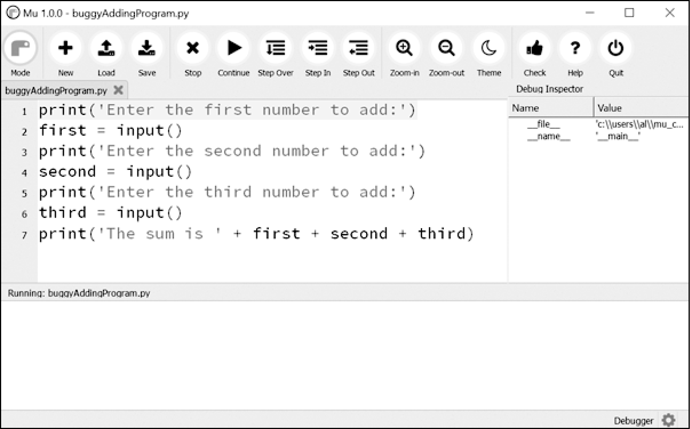

### 11.5　Mu的调试器

“调试器”是Mu编辑器、IDLE和其他编辑器软件的一项功能，它让你每次执行一行程序。调试器将运行一行代码，然后等待你告诉它是否继续。像这样让程序运行在调试器之下，你可以随便花多少时间，检查程序运行时任意一个时刻的变量的值。对于追踪bug，这是一个很有价值的工具。

要启用Mu的调试器，就单击顶部按钮行中的Debug按钮，它在Run按钮旁边。与底部的常规输出窗格一样，“Debug Inspector”（调试检查器）窗格将在窗口的右侧打开。这个窗格列出了程序中变量的当前值。图11-1所示为调试器在程序运行第一行代码之前就暂停了程序的执行。可以在文件编辑器中看到该行高亮显示。

调试模式也会将以下新按钮添加到编辑器顶部：Continue、Step In、Step Over和Step Out。平时的Stop按钮也可用。

<b class="my_markdown">图11-1　Mu在调试器下运行程序</b>

