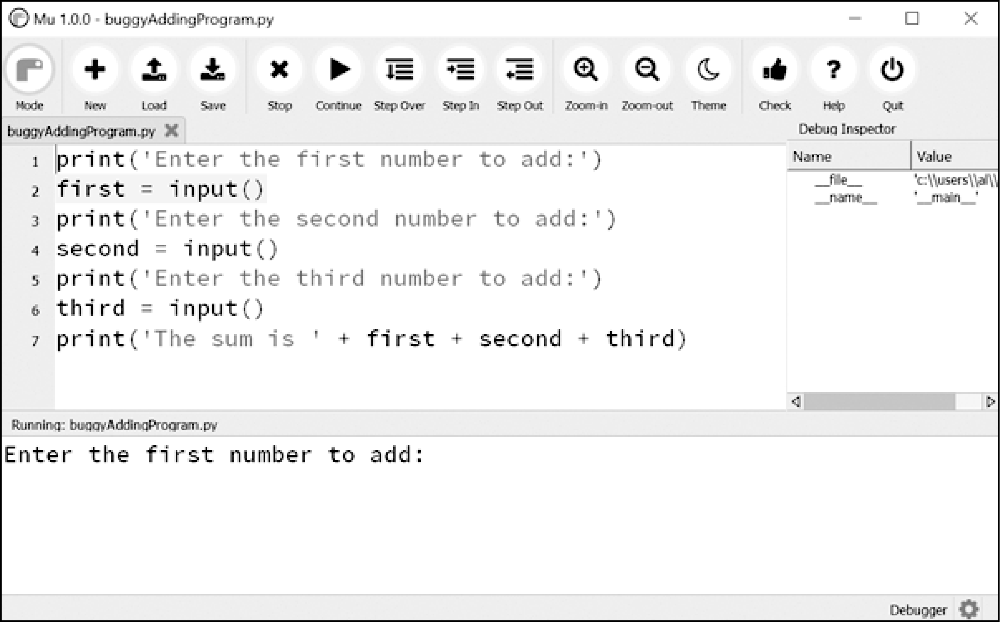
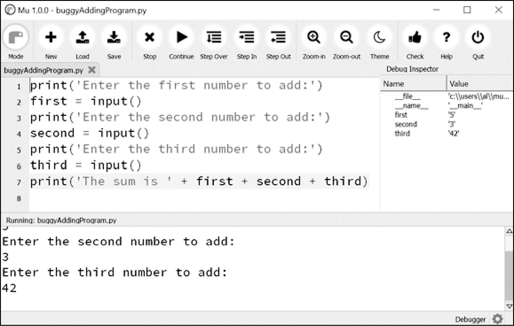

### 11.5.6　调试一个数字相加的程序

打开一个新的文件编辑器窗口，输入以下代码：

```javascript
print('Enter the first number to add:')
first = input()
print('Enter the second number to add:')
second = input()
print('Enter  the  third  number  to  add:')
third  =  input()
print('The sum is ' + first + second + third)
```

将它保存为buggyAddingProgram.py，第一次运行它时不启用调试器。程序的输出结果像这样：

```javascript
Enter  the  first number  to  add:
5
Enter the second number to add:
3
Enter the third number to add:
42
The sum is 5342
```

这个程序没有崩溃，但求和显然是错的。再次运行它，这次在调试器控制之下运行。

当你单击Debug按钮时，程序将暂停在第1行，这是将要执行的代码。Mu看起来如图11-1所示。

单击一次Step Over按钮，执行第一个 `print()` 调用。这里应该单击Step Over按钮，而不是Step In，因为你不希望进入 `print()` 函数的代码。（尽管Mu应该会阻止调试器进入Python的内置函数。）调试器转向第2行，文件编辑器中的第2行将高亮显示，如图11-2所示。这告诉你程序当前执行到哪里。


<center class="my_markdown"><b class="my_markdown">图11-2 单击Step Over按钮后的Mu编辑器窗口</b></center>

再次单击Step Over按钮，执行 `input()` 函数调用，当Mu等待你在输出窗格中为 `input()` 调用输入内容时，高亮将会消失。输入5并按回车键，高亮会重新出现。

继续单击Step Over按钮，输入3和42作为接下来的两个数，直到调试器位于第7行——程序中最后的 `print()` 调用。Mu编辑器窗口应该如图11-3所示。


<center class="my_markdown"><b class="my_markdown">图11-3 右侧的Debug Inspector窗格显示，变量设置为字符串而不是整数，从而导致该错误</b></center>

在Debug Inspector窗格中可以看到， `first` 、 `second` 和 `third` 变量被设置为字符串值，而不是整型值。当最后一行执行时，这些字符串连接起来，而不是加起来，从而导致了这个bug。

用调试器单步执行程序很有用，但也可能很慢。如果你希望程序正常运行，但在特定的代码行停止，那么可以使用断点让调试器做到这一点。

