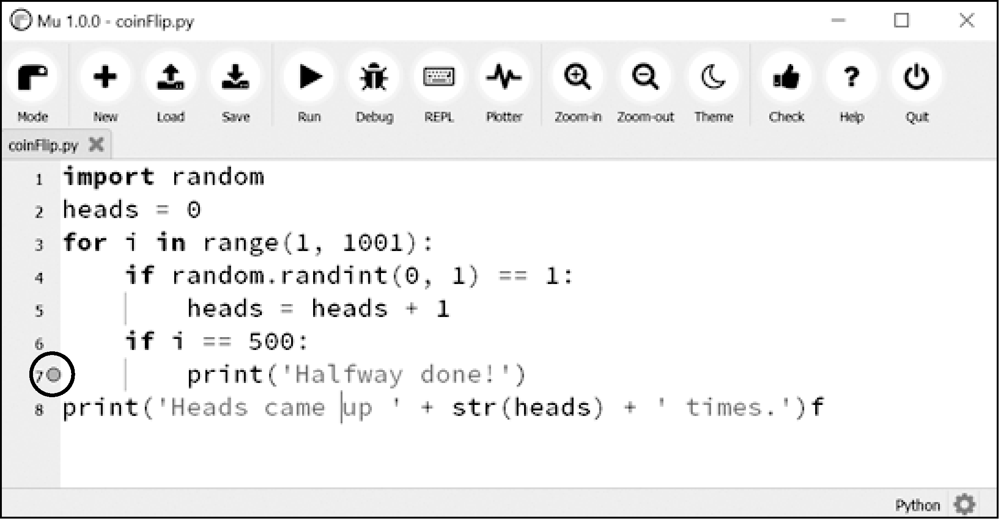

### 11.5.7　断点

“断点”可以设置在特定的代码行上，当程序执行到达该行时，它迫使调试器暂停。在一个新的文件编辑器窗口中输入以下程序，它模拟投掷1000次硬币，将该文件保存为coinFlip.py：

```javascript
import random 
heads = 0
for i in range(1, 1001):
  ❶ if random.randint(0,  1)  ==  1:
           heads = heads + 1
     if i == 500:
        ❷ print('Halfway done!')
print('Heads came up ' + str(heads) + ' times.')
```

在半数时间里， `random.randint(0, 1)` 调用❶将返回0，在另外半数时间里将返回1。这可以用来模拟硬币投掷，其中1代表正面。当不用调试器运行该程序时，它很快会输出下面的内容：

```javascript
Halfway done!
Heads came up 490 times.
```

如果启用调试器来运行这个程序，那么就必须单击几千次Step Over按钮程序才能结束。如果你在程序执行到一半时对 `heads` 的值感兴趣，那么等1000次硬币投掷完500次后，可以在代码行 `print('Halfway done!')` ❷上设置断点。要设置断点，请在文件编辑器中单击该行代码的行号，会出现一个红点来标识该断点，如图11-4所示。


<center class="my_markdown"><b class="my_markdown">图11-4 设置断点，让一个红点（圆圈内）出现在行号边上</b></center>

不要在 `if` 语句上设置断点，因为 `if` 语句会在循环的每次迭代中都执行。在 `if` 语句内的代码上设置断点，调试器就会只在执行进入 `if` 语句时才中断。

带有断点的代码行旁边有一个红点。如果在调试器下运行该程序，那么开始它会暂停在第一行，像平时一样。但如果单击Continue按钮，程序将全速运行，直到遇到设置了断点的代码行。然后可以单击Continue、Step Over、Step In或Step Out按钮，让程序正常继续。

如果希望清除断点，请再次单击该行号，红点将消失，以后调试器将不会在该行代码上中断。

