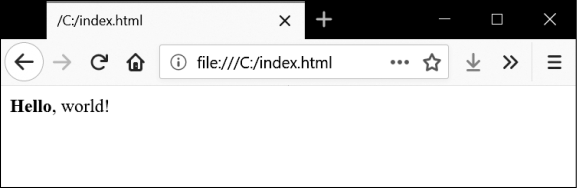
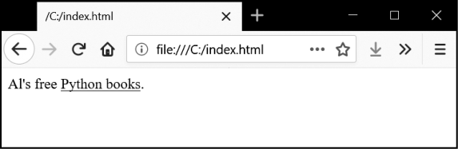

### 12.4.2　快速复习

假定你有一段时间没有看过HTML了，这里是对基本知识的快速复习。HTML文件是一个纯文本文件，带有.html文件扩展名。这种文件中的文本被“标签”环绕，标签是尖括号包围的单词。标签告诉浏览器以怎样的格式显示该页面。一个开始标签和一个结束标签可以包围某段文本，形成一个“元素”。“文本”（或“内部的HTML”）是在开始标签和结束标签之间的内容。例如，下面的HTML在浏览器中显示Hello, world!，其中Hello用粗体显示：

```javascript
<strong>Hello</strong>, world!
```

这段HTML在浏览器中看起来如图12-1所示。


<center class="my_markdown"><b class="my_markdown">图12-1　浏览器渲染的Hello, world!</b></center>

开始标签 `<strong>` 表明标签包围的文本将使用粗体，结束标签 `</strong>` 告诉浏览器粗体文本到此结束。

HTML中有许多不同的标签。有一些标签具有额外的特性，在尖括号内以“属性”的方式展现。例如， `<a>` 标签包含一段文本，它应该是一个链接。这段文本链接的URL是由 `href` 属性确定的。下面是一个例子：

```javascript
Al's free <a href="https://inv***">Python books</a>.
```

这段HTML在浏览器中看起来如图12-2所示。


<center class="my_markdown"><b class="my_markdown">图12-2　浏览器中渲染的链接</b></center>

某些元素具有 `id` 属性，可以用来在页面上唯一地确定该元素。你常常会告诉程序，根据元素的 `id` 属性来寻找它。所以利用浏览器的开发者工具弄清楚元素的 `id` 属性是编写Web抓取程序常见的任务。

