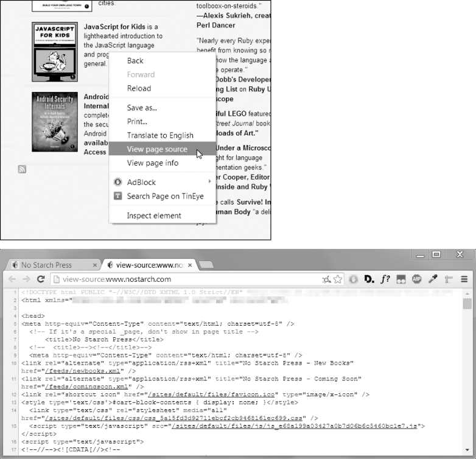

### 12.4.3　查看网页的HTML源代码

对于程序要处理的网页，你需要查看它的HTML源代码。要做到这一点，在浏览器的任意网页上单击鼠标右键（或在macOS上按快捷键Ctrl-鼠标左键），选择View Source或View page source，查看该网页的HTML文本，如图12-3所示。这是浏览器实际接收到的文本。浏览器知道如何通过这个HTML显示（即“渲染”）网页。

<b class="my_markdown">图12-3　查看网页的源代码</b>

我强烈建议你查看一些自己喜欢的网站的HTML源代码。在查看源代码时，如果你不能完全理解也没有关系。你不需要完全掌握HTML也能编写简单的Web抓取程序，毕竟你不是要编写自己的网站。不需要太多的知识，就能从已有的网站中挑选数据。

