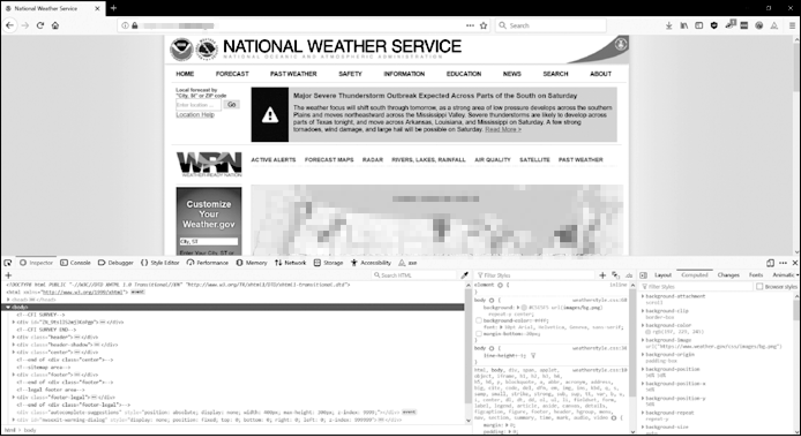

### 12.4.4　打开浏览器的开发者工具

除了查看网页的源代码，你还可以利用浏览器的开发者工具来检查页面的HTML。在Windows版的Chrome和IE中，开发者工具已经安装了。可以按F12键，让它们出现，如图12-4所示。再次按F12键，可以让开发者工具消失。在Chrome中，也可以选择ViewDeveloperDeveloper Tools，调出开发者工具。在macOS中按Command-Option-I快捷键，将打开Chrome的开发者工具。

<b class="my_markdown">图12-4　Chrome浏览器中的开发者工具窗口</b>

对于Firefox，可以在Windows和Linux操作系统中按Ctrl-Shift-C快捷键，或在macOS中按Command-option-C快捷键，调出开发者工具查看器。它的布局几乎与Chrome的开发者工具一样。

在Safari中，打开Preferences窗口，并在Advanced窗格选中Show Develop menu in the menu bar选项。在它启用后，你可以按Command-option-I快捷键，调出开发者工具。

在浏览器中启用或安装了开发者工具之后，可以在网页中任何部分单击鼠标右键，在弹出的菜单中选择Inspect Element，查看页面中这一部分对应的HTML。如果需要在Web抓取程序中解析HTML，这很有帮助。

**不要用正则表达式来解析HTML**

在一个字符串中定位特定的一段HTML，这似乎很适合使用正则表达式。但是，我建议你不要这么做。HTML的格式可以有许多不同的方式，并且仍然被认为是有效的HTML，但尝试用正则表达式来捕捉所有这些可能的变化将非常繁琐，并且容易出错。使用专门用于解析HTML的模块，如Beautiful Soup，将更不容易导致bug。

在Stack Overflow等论坛，你会看到更充分的讨论，从而了解为什么不应该用正则表达式来解析HTML。

