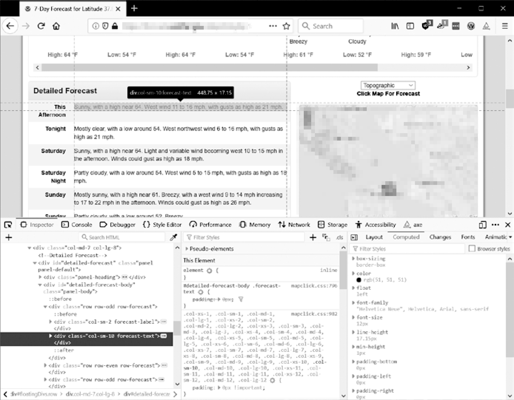

### 12.4.5　使用开发者工具来寻找HTML元素

程序利用 `requests` 模块下载了一个网页之后，你会得到该页的HTML内容，它将是一个字符串值。现在你需要弄清楚这段HTML的哪个部分对应于网页上你感兴趣的信息。这就是可以利用浏览器的开发者工具的地方。

假定你需要编写一个程序，从美国气象官网获取天气预报数据。在写代码之前，先做一点调查。如果你访问该网站，并查找邮政编码94105，该网站将打开一个页面，显示该地区的天气预报。

如果你想抓取那个邮政编码对应的气温信息，怎么办？右击它在页面的位置（或在macOS上按Control-鼠标左键），在弹出的菜单中选择Inspect Element。这将打开开发者工具窗口，其中显示产生这部分网页的HTML。图12-5所示为开发者工具打开显示气温的HTML。请注意，如果美国气象网站改变了网页的设计，你需要重复这个过程来检查新的元素。

<b class="my_markdown">图12-5　用开发者工具查看包含气温文本的元素</b>

通过开发者工具，你可以看到网页中负责气温部分的HTML是 `
Sunny, with a high near 64. West wind 11 to 16 mph, with gusts as high as 21 mph.
.` 。这正是你要找的东西。看起来气温信息包含在一个 `
` 元素中，带有 `forecast-text`  CSS类。在浏览器的开发者控制台中右击这个元素，在出现的菜单中选择CopyCSS选择器。这将一个类似 `'div.row-odd:nth-child(1) > div:nth- child(2)'` 这样的字符串复制到剪贴板上。你可以将这个字符串用于 `Beautiful Soup` 的 `select()` 或 `selenium` 的 `find_element_by_css_selector()` 方法，这将在本章后面解释。既然你知道了要找的是什么， `Beautiful Soup` 模块就可以帮助你在这个字符串中找到它。

