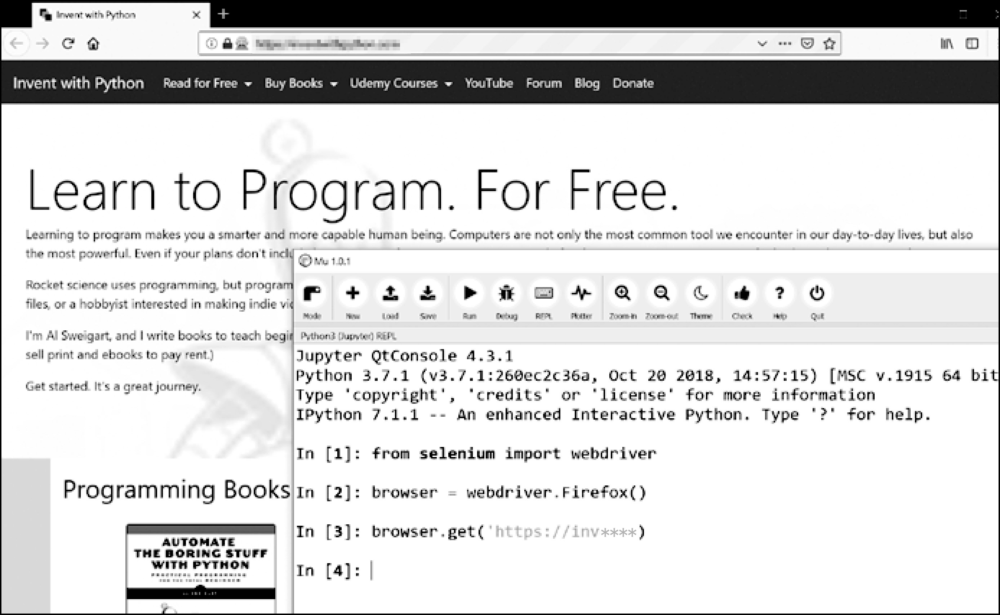

### 12.8.1　启动selenium控制的浏览器

以下例子将展示如何控制FireFox浏览器。如果你还没有FireFox，可以自行搜索并免费下载它。可以通过在命令行窗口上执行 `pip install --user seleniumf` 来安装 `selenium` ，更多信息见附录A。

导入 `selenium` 的模块需要一点技巧，不是 `import selenium` ，而是要运行 `from selenium import webdriver` （为什么 `selenium` 模块要使用这种方式导入？答案超出了本书的范围）。

然后，你可以用 `selenium` 启动FireFox浏览器。在交互式环境中输入以下代码：

```javascript
>>> from selenium import webdriver
>>> browser = webdriver.Firefox()
>>>  type(browser)
<class 'selenium.webdriver.firefox.webdriver.WebDriver'>
>>> browser.get('https://inv****')
```

你会注意到，当 `webdriver.Firefox()` 被调用时，FireFox浏览器启动了。对值 `webdriver.Firefox()` 调用 `type()` ，揭示它具有 `WebDriver` 数据类型。调用 `browser. get('http://inv****')` 将浏览器指向Invent with Python官网。浏览器看起来应该如图12-7所示。


<center class="my_markdown"><b class="my_markdown">图12-7　在Mu中调用 `webdriver.Firefox()` 和 `get()` 后，FireFox浏览器出现了</b></center>

如果遇到错误信息“ `'geckodriver' executable needs to be in PATH.` ”，那么你需要手动下载Firefox的webdriver，然后才能用 `selenium` 来控制它。如果你安装了Firefox以外的浏览器， `selenium` 也可以控制其他浏览器。

对于Firefox，请在 GitHub 中搜索mozilla/geckodriver/releases，然后下载你的操作系统的geckodriver。（“Gecko”是Firefox中使用的浏览器引擎的名称。）例如，在Windows操作系统中，需要下载geckodriver-v0.24.0-win64.zip；在macOS中，需要下载geckodriver-v0.24.0- macos.tar. gz。较新版本的名字会有稍微不同。下载的ZIP文件将包含一个geckodriver.exe（在Windows操作系统上）或geckodriver（在macOS和Linux操作系统上）文件，你可以把它放在系统的PATH路径上。附录 B 有关于系统PATH的信息。

对于Chrome浏览器，请访问ChromePriver下载页面以下载你的操作系统的ZIP文件。这个ZIP文件将包含一个chromedriver.exe（在Windows操作系统上）或chromedriver（在macOS或Linux操作系统上）文件，可以将它放在系统的PATH路径上。

其他主要的网络浏览器也有webdriver，可以通过在因特网上搜索“<浏览器名称> webdriver”来找到。

如果你在 `selenium` 的控制下打开新的浏览器仍然有问题，可能是因为当前版本的浏览器与 `selenium` 模块不兼容。一种解决方法是安装一个旧版本的浏览器，或者更简单地说，安装一个旧版本的 `selenium` 模块。你可以在PyPI官网上找到 `selenium` 版本号列表。不幸的是， `selenium` 和浏览器的版本之间的兼容性有时会失效，你也许需要在网上搜索可能的解决方案。附录A有更多关于运行 `pip` 来安装特定版本的 `selenium` 的信息。（例如，你可以运行 `pip install –user –U selenium==3.14.1。` ）

