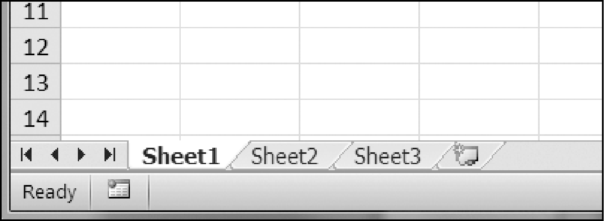

### 13.3　读取Excel文档

本章的例子将使用一个电子表格example.xlsx，它保存在根文件夹中。你可以自己创建这个电子文档，或从异步社区本书对应页面下载。图13-1所示为3个默认的表，名为Sheet1、Sheet2和Sheet3，这是Excel自动为新工作簿提供的（在不同操作系统和电子表格程序中，提供的默认表个数可能会不同）。

<b class="my_markdown">图13-1　工作簿中表的标签页在Excel的左下角</b>

示例文件中的Sheet 1应该如表 13-1所示（如果你没有从网站下载example.xlsx，就要在工作表中自己输入这些数据）。

<b class="my_markdown">表13-1　 `example.xlsx` 电子表格</b>

| A | B | C |
| :-----  | :-----  | :-----  | :-----  | :-----  |
| 1 | 4/5/2015 1:34:02 PM | Apples | 73 |
| 2 | 4/5/2015 3:41:23 AM | Cherries | 85 |
| 3 | 4/6/2015 12:46:51 PM | Pears | 14 |
| 4 | 4/8/2015 8:59:43 AM | Oranges | 52 |
| 5 | 4/10/2015 2:07:00 AM | Apples | 152 |
| 6 | 4/10/2015 6:10:37 PM | Bananas | 23 |
| 7 | 4/10/2015 2:40:46 AM | Strawberries | 98 |

既然有了示例电子表格，就来看看如何用 `openpyxl` 模块来操作它。

