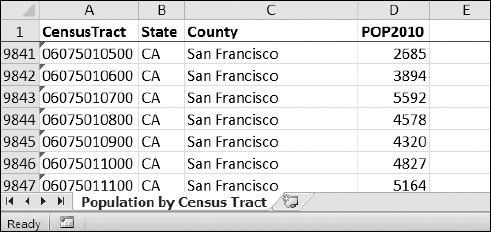

### 13.4　项目：从电子表格中读取数据

假定你有一张电子表格，其数据来自2010年美国人口普查。你有一个无聊的任务，要遍历表中的几千行，计算总的人口以及每个县的普查区的数目（普查区就是一个地理区域，是为人口普查而定义的）。每行表示一个人口普查区。我们将这个电子表格文件命名为censuspopdata.xlsx，可以从异步社区本书对应页面下载它。它的内容如图13-2所示。

<b class="my_markdown">图13-2　censuspopdata.xlsx电子表格</b>

尽管Excel能够计算多个选中单元格的和，但你仍然需要选中3000个以上县的单元格。即使手动计算一个县的人口只需要几秒，处理整张电子表格也需要几小时。

在这个项目中，你要编写一个脚本，从人口普查电子表格文件中读取数据，并在几秒内计算出每个县的统计值。

程序需要完成以下任务。

1．从Excel电子表格中读取数据。

2．计算每个县中普查区的数目。

3．计算每个县的总人口。

4．输出结果。

这意味着代码需要执行以下操作。

1．用 `openpyxl` 模块打开Excel文档并读取单元格。

2．计算所有普查区和人口数据，并将它保存到一个数据结构中。

3．利用 `pprint` 模块，将该数据结构写入一个扩展名为.py的文本文件。

