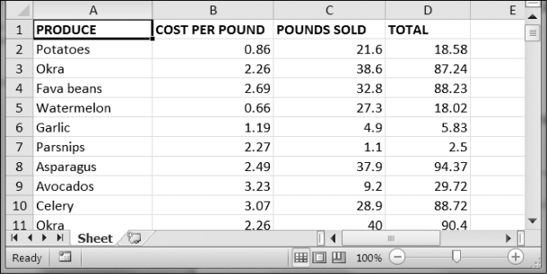

### 13.6　项目：更新电子表格

这个项目需要编写一个程序，用于更新产品销售电子表格中的单元格。程序将遍历这个电子表格，找到特定类型的产品，并更新它们的价格。请从异步社区本书对应页面下载电子表格produceSales.xlsx。图13-3所示为这个电子表格的一部分。

<b class="my_markdown">图13-3　产品销售的电子表格</b>

每一行代表一次单独的销售。列分别是销售产品的类型（A）、产品每磅的价格（B）、销售的磅数（C），以及这次销售的总收入（D）。TOTAL列设置为Excel公式=ROUND(B3*C3, 2)，它将每磅的成本乘以销售的磅数，并将结果取整到分。有了这个公式，如果列B或C发生变化，TOTAL列中的单元格将自动更新。

现在假设 `Garlic` 、 `Celery` 和 `Lemon` 的价格输入得不正确。这让你需要执行一项无聊的任务：遍历这个电子表格中的几千行，更新所有 `Garlic` 、 `Celery` 和 `Lemon` 行中每磅的价格。你不能简单地对价格查找替换，因为可能有其他的产品价格一样，你不希望错误地“更正”。对于几千行数据，手动操作可能要几小时。但你可以编写程序，几秒内完成这个任务。

程序需要完成以下任务。

1．循环遍历所有行。

2．如果该行是 `Garlic` 、 `Celery` 或 `Lemon` ，就更新价格。

这意味着代码需要执行以下操作。

1．打开电子表格文件。

2．针对每一行，检查列A的值是不是 `Celery` 、 `Garlic` 或 `Lemon` 。

3．如果是，更新列B中的价格。

4．将该电子表格保存为一个新文件（这样就不会丢失原来的电子表格，以防万一）。

