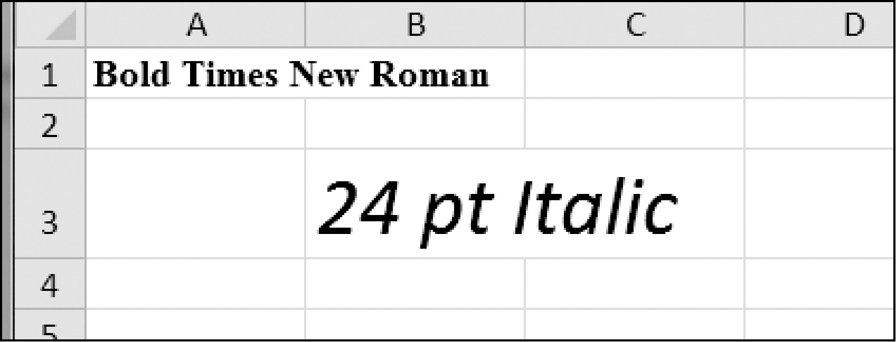

### 13.8　Font对象

要设置 `font` 属性，就向 `Font()` 函数传入关键字参数。表13-2所示为 `Font()` 函数可能的关键字参数。

<center class="my_markdown"><b class="my_markdown">表13-2　 `Font style` 属性的关键字参数</b></center>

| 关键字参数 | 数据类型 | 描述 |
| :-----  | :-----  | :-----  | :-----  | :-----  |
| `name` | 字符串 | 字体名称，如 `'Calibri'` 或 `'Times New Roman'` |
| `size` | 整型 | 大小点数 |
| `bold` | 布尔型 | `True` 表示粗体 |
| `italic` | 布尔型 | `True` 表示斜体 |

可以调用 `Font()` 来创建一个 `Font` 对象，并将这个 `Font` 对象保存在一个变量中，然后将该变量赋给 `Cell` 对象的 `font` 属性。例如，下面的代码创建了各种字体风格：

```javascript
>>> import openpyxl
>>> from openpyxl.styles import Font
>>> wb = openpyxl.Workbook()
>>> sheet = wb['Sheet']
>>> fontObj1 = Font(name='Times New Roman', bold=True)
>>> sheet['A1'].font = fontObj1
>>> sheet['A1'] = 'Bold Times New Roman'
>>> fontObj2 = Font(size=24, italic=True)
>>> sheet['B3'].font = fontObj2
>>> sheet['B3'] = '24 pt Italic'
>>> wb.save('styles.xlsx')
```

这里，我们将一个 `Font` 对象保存在 `fontObj1` 中，然后将A1的 `Cell` 对象的 `font` 属性设置为 `fontObj1` 。我们对另一个 `Font` 对象重复这个过程，以设置第二个单元格的字体。运行这段代码后，电子表格中A1和B3单元格的字体风格将被设置为自定义的字体风格，如图13-4所示。


<center class="my_markdown"><b class="my_markdown">图13-4　自定义字体风格的电子表格</b></center>

对于单元格A1，我们将字体名称设置为 `'Times New Roman'` ，并将 `bold` 设置为 `True` ，这样我们的文本将以粗体Times New Roman的方式显示。我们没有指定大小，因此使用 `openpyxl` 的默认值11。在单元格B3中，我们的文本是斜体，大小是24。我们没有指定字体的名称，因此使用 `openpyxl` 的默认值Calibri。

