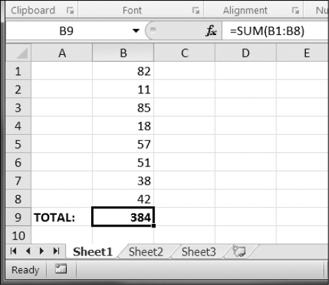

### 13.9　公式

公式以一个等号开始，可以配置单元格来让它包含通过其他单元格计算得到的值。在本节中，你将利用 `openpyxl` 模块，用编程的方式在单元格中添加公式，就像添加普通的值一样。例如：

```javascript
>>> sheet['B9'] = '=SUM(B1:B8)'
```

这里将=SUM(B1:B8)作为单元格B9的值，将B9单元格设置为一个公式，来计算单元格B1到B8的和，如图13-5所示。


<center class="my_markdown"><b class="my_markdown">图13-5　单元格B9包含了公式=SUM(B1:B8)，计算单元格B1到B8的和</b></center>

为单元格设置公式就像设置其他文本值一样。在交互式环境中输入以下代码：

```javascript
>>> import openpyxl
>>> wb = openpyxl.Workbook()
>>> sheet = wb.active
>>> sheet['A1'] = 200
>>> sheet['A2'] = 300
>>> sheet['A3'] = '=SUM(A1:A2)' # Set the formula.
>>> wb.save('writeFormula.xlsx')
```

单元格A1和A2分别设置为200和300。单元格A3设置为一个公式，求出A1和A2的和。如果在Excel中打开这个电子表格，那么A3的值将显示为500。

Excel公式为电子表格提供了一定程度的编程能力，但对于复杂的任务，它很快就会无能为力。例如，即使你非常熟悉Excel的公式，要想弄清楚=IFERROR (TRIM(IF(LEN(VLOOKUP(F7, Sheet2!$A$1:$B$10000, 2, FALSE))>0,SUBSTITUTE (VLOOKUP(F7, Sheet2!$A$1:$B$10000, 2, FALSE), " ", ""),"")), "")实际上做了什么，也是非常头痛的事。Python代码的可读性要好得多。

