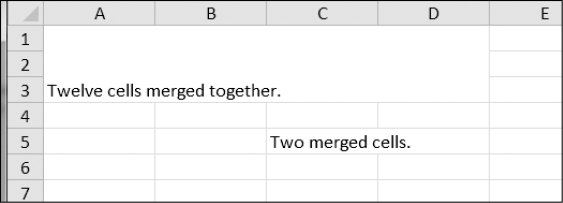

### 13.10.2　合并和拆分单元格

利用 `merge_cells()` 工作表方法，可以将一个矩形区域中的单元格合并为一个单元格。在交互式环境中输入以下代码：

```javascript
>>> import openpyxl
>>> wb = openpyxl.Workbook()
>>> sheet = wb.active
>>> sheet.merge_cells('A1:D3') # Merge all these cells.
>>> sheet['A1'] = 'Twelve cells merged together.'
>>> sheet.merge_cells('C5:D5') # Merge these two cells.
>>> sheet['C5'] = 'Two merged cells.'
>>> wb.save('merged.xlsx')
```

`merge_cells()` 的参数是一个字符串，表示要合并的矩形区域左上角和右下角的单元格： `'A1:D3'` 将12个单元格合并为一个单元格。要设置合并后单元格的值，只需要设置这一组合并单元格左上角的单元格的值。

如果运行这段代码，merged.xlsx看起来如图13-7所示。


<center class="my_markdown"><b class="my_markdown">图13-7　在电子表格中合并单元格</b></center>

要拆分单元格，就调用 `unmerge_ cells()` 工作表方法。在交互式环境中输入以下代码：

```javascript
>>> import openpyxl
>>> wb = openpyxl.load_workbook('merged.xlsx')
>>> sheet = wb.active
>>> sheet.unmerge_cells('A1:D3') # Split these cells up.
>>> sheet.unmerge_cells('C5:D5')
>>> wb.save('merged.xlsx')
```

如果保存变更，然后查看这个电子表格，就会看到合并的单元格恢复成了独立的单元格。

