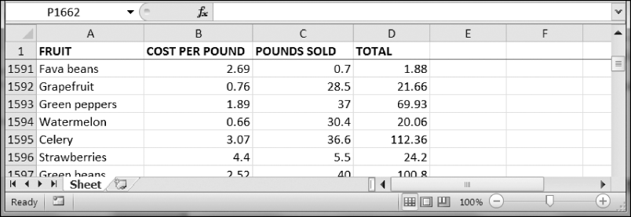

### 13.10.3　冻结窗格

对于太大而不能一屏显示的电子表格，“冻结”顶部的几行或最左边的几列是很有帮助的。例如，就算用户滚动电子表格，冻结的列或行表头也是始终可见的。这称为“冻结窗格”。在 `openpyxl` 中，每个 `Worksheet` 对象都有一个 `freeze_panes` 属性，该属性可以设置为一个 `Cell` 对象或一个单元格坐标的字符串。请注意，单元格上边的所有行和左边的所有列都会冻结，但单元格所在的行和列不会冻结。

要解冻所有的单元格，就将 `freeze_panes` 设置为 `None` 或 `'A1'` 。表13-3所示为 `freeze_panes` 设置的一些例子，其中的哪些行或列会冻结。

<center class="my_markdown"><b class="my_markdown">表13-3　冻结窗格的例子</b></center>

| `freeze_panes` 的设置 | 冻结的行和列 |
| :-----  | :-----  | :-----  | :-----  |
| `sheet.freeze_panes = 'A2'` | 行1 |
| `sheet.freeze_panes = 'B1'` | 列A |
| `sheet.freeze_panes = 'C1'` | 列A和列B |
| `sheet.freeze_panes = 'C2'` | 行1、列A和列B |
| `sheet.freeze_panes = 'A1'` 或  `sheet.freeze_panes = None` | 没有冻结窗格 |

确保你有产品销售电子表格（produceSales）。然后在交互式环境中输入以下代码：

```javascript
>>> import openpyxl
>>> wb = openpyxl.load_workbook('produceSales.xlsx')
>>> sheet = wb.active
>>> sheet.freeze_panes = 'A2' # Freeze the rows above A2.
>>> wb.save('freezeExample.xlsx')
```

如果将 `freeze_panes` 属性设置为 `'A2'` ，那么无论用户将电子表格滚动到何处，行1将永远可见，如图13-8所示。


<center class="my_markdown"><b class="my_markdown">图13-8　将 `freeze_panes` 设置为 `'A2'` ，无论用户如何滚动电子表格，行1将永远可见</b></center>

