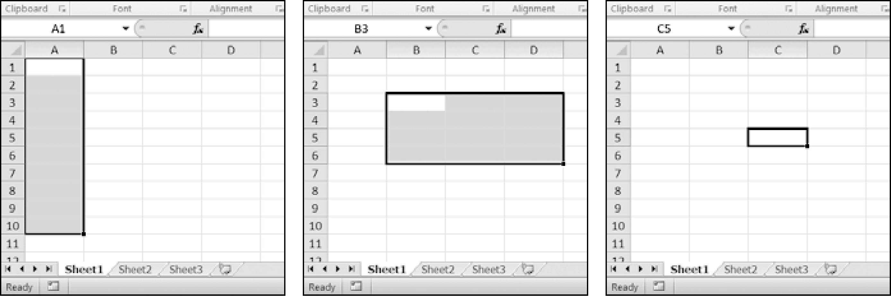
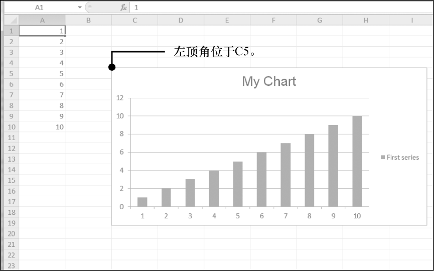

### 13.11　图表

`openpyxl` 支持利用工作表中单元格的数据来创建条形图、折线图、散点图和饼图。要创建图表，需要做下列事情。

1．从一个矩形区域选择单元格来创建一个 `Reference` 对象。

2．通过传入 `Reference` 对象来创建一个 `Series` 对象。

3．创建一个 `Chart` 对象。

4．将 `Series` 对象添加到 `Chart` 对象。

5．可选地设置 `Chart` 对象的 `drawing.top` 、 `drawing.left` 、 `drawing.width` 和 `drawing.height` 属性。

6．将 `Chart` 对象添加到 `Worksheet` 对象。

`Reference` 对象需要一些解释。 `Reference` 对象是通过调用 `openpyxl.charts` .  `Reference()` 函数并传入以下3个参数创建的。

1．包含图表数据的 `Worksheet` 对象。

2．两个整数的元组，代表矩形选择区域的左上角单元格，该区域包含图表数据：元组中第一个整数是行，第二个整数是列。请注意第一行是1，不是0。

3．两个整数的元组，代表矩形选择区域的右下角单元格，该区域包含图表数据：元组中第一个整数是行，第二个整数是列。

图13-9所示为坐标参数的一些例子。


<center class="my_markdown"><b class="my_markdown">图13-9　从左到右： `(1,1), (10,1); (3,2), (6,4); (5,3), (5,3)`</b></center>

在交互式环境中输入以下代码，这可以创建一个条形图并将其添加到电子表格中：

```javascript
>>> import openpyxl
>>> wb = openpyxl.Workbook()
>>> sheet = wb.active
>>> for i in range(1, 11): # create some data in column A
..． sheet['A' + str(i)] = I
...
>>> refObj = openpyxl.chart.Reference(sheet, min_col=1, min_row=1,
max_col=1, max_row=10)
>>> seriesObj = openpyxl.chart.Series(refObj, title='First series')
>>> chartObj = openpyxl.chart.BarChart()
>>> chartObj.title = 'My Chart'
>>> chartObj.append(seriesObj)
>>> sheet.add_chart(chartObj, 'C5')
>>> wb.save('sampleChart.xlsx')
```

得到的电子表格如图13-10所示。


<center class="my_markdown"><b class="my_markdown">图13-10　添加了一个图表的电子表格</b></center>

通过调用 `openpyxl.charts.BarChart()` 我们创建了一个条形图。也可以调用 `openpyxl. charts.LineChart()` 、 `openpyxl.charts.ScatterChart()` 和 `openpyxl. charts. PieChart()` 来创建折线图、散点图和饼图。

