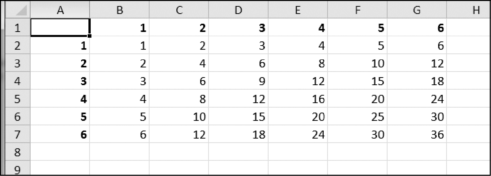

### 13.14.1　乘法表

创建程序multiplicationTable.py，从命令行接收数字N，在一个Excel电子表格中创建一个N×N的乘法表。例如，如果这样执行程序：

```javascript
py multiplicationTable.py 6
```

它应该创建一个图13-11所示的电子表格。


<center class="my_markdown"><b class="my_markdown">图13-11　在电子表格中生成的乘法表</b></center>

行1和列A应该用作标签，且使用粗体。

