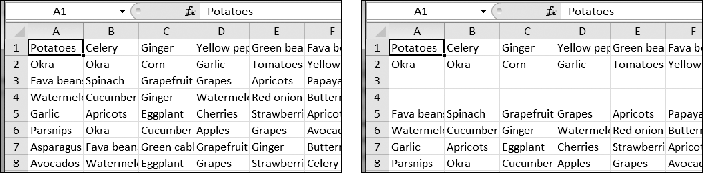

### 13.14.2　空行插入程序

创建一个程序blankRowInserter.py，它接收两个整数和一个文件名字符串作为命令行参数。我们将第一个整数称为N，第二个整数称为M。程序应该从第N行开始，在电子表格中插入M个空行。例如，如果这样执行程序：

```javascript
python blankRowInserter.py 3 2 myProduce.xlsx
```

那么执行之前和之后的电子表格如图13-12所示。


<center class="my_markdown"><b class="my_markdown">图13-12　在第3行插入两个空行之前（左边）和之后（右边）</b></center>

此程序可以这样写：读入电子表格的内容，然后在写入新的电子表格时，利用 `for` 循环复制前面N行。对于剩下的行，行号加上M，然后将其写入输出的电子表格。

