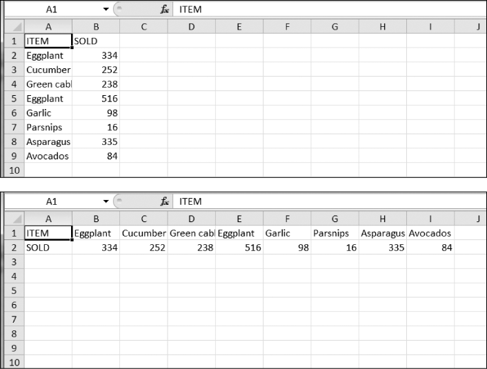

### 13.14.3　电子表格单元格翻转程序

编写一个程序来翻转电子表格中行和列的单元格。例如，第5行第3列的值将出现在第3行第5列（反之亦然）。这应该针对电子表格中的所有单元格进行。例如，之前和之后的电子表格看起来应该如图13-13所示。

<b class="my_markdown">图13-13　翻转之前（上面）和之后（下面）的电子表格</b>

此程序可以这样写：利用嵌套的 `for` 循环，将电子表格中的数据读入一个列表的列表；这个数据结构用 `sheetData[x][y]` 表示列 `x` 和行 `y` 处的单元格；然后，在写入新电子表格时，将 `sheetData[y][x]` 写入列 `x` 和行 `y` 处的单元格。

