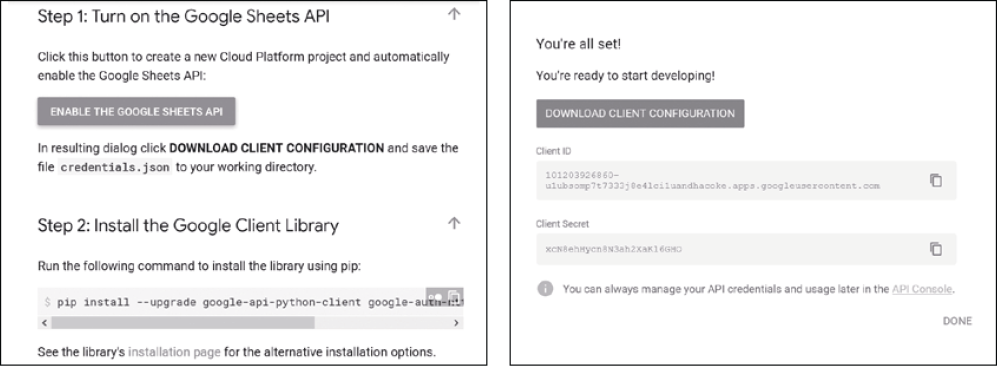
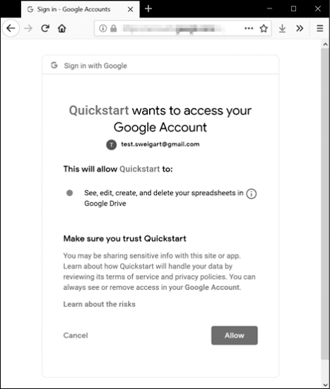

### 14.1.1　获取证书和令牌文件

在使用EZSheets之前，你需要为Google账户启用Google Sheets和Google Drive API。请访问以下网页，然后单击每个网页顶部的Enable API按钮。

+ Google Sheets API首页。
+ Google Drive API首页。

你还需要获得以下3个文件，并将它们与使用EZSheets的.py Python脚本保存在同一个文件夹中。

+ 一个名为credentials-sheet.json的证书文件。
+ 一个名为token-sheets.pickle的Google Sheets令牌。
+ 一个名为token-drive.pickle的Google Drive令牌。

证书文件将生成令牌文件。获取证书文件的最简单的方法是进入Google Sheets Python快速入门页面，单击ENABLE THE GOOGLE SHEETS API按钮，如图14-1所示。你需要登录到你的Google账户才能查看这个页面。

<b class="my_markdown">图14-1　获取credentials.json文件</b>

单击这个按钮会弹出一个窗口，里面有一个DOWNLOAD CLIENT CONFIGURATION链接，让你下载一个credentials.json文件。将此文件重命名为credentials-sheets.json，并将它与Python脚本放在同一个文件夹中。

在有了credentials-sheets.json文件之后，运行 `import ezsheets` 模块。当你第一次导入 `EZSheets` 模块时，它会打开一个新的浏览器窗口，让你登录到你的Google账户。单击Allow按钮，如图14-2所示。

<b class="my_markdown">图14-2 允许Quickstart访问你的Google账户</b>

关于Quickstart的消息来自这一事实：你从Google Sheets Python Quickstart页面下载了证书文件。注意，这个窗口会打开两次：第一次为了Google Sheets访问，第二次为了Google Drive访问。EZSheets使用Google Drive访问权限来上传、下载和删除电子表格。

在你登录后，浏览器窗口会提示你关闭它，而token- sheets.pickle和token-drive.pickle文件会出现在与credentials- sheets.json相同的文件夹中。你只需要在第一次运行 `import ezsheets` 时完成这个过程。

如果你在单击Allow按钮后遇到错误，并且页面似乎被挂起，那请确认你已经从本节开头的链接中启用了Google Sheets和Drive API。Google的服务器可能需要几分钟的时间来注册这一更改，所以你可能需要等待一会儿，然后才能使用EZSheets。

不要与任何人分享证书或令牌文件：将它们当作口令一样对待。

