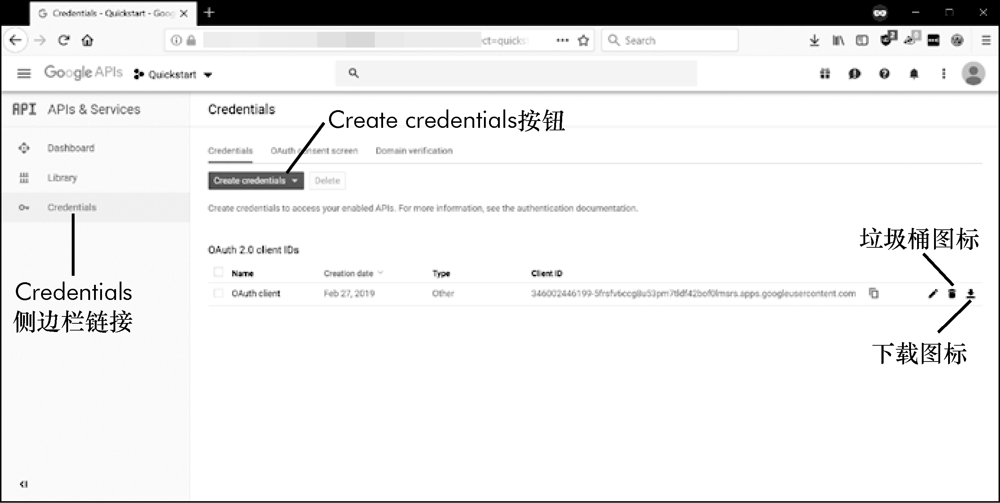

### 14.1.2　撤销证书文件

如果你不小心将这些证书或令牌文件与他人共享，那他们不能更改你的Google账户口令，但可以访问你的电子表格。你可以通过访问Google云平台开发者的控制台页面，在Google APIs中的API和服务撤销这些文件。你需要登录到你的Google账户才能查看这个页面。单击侧边栏上的Credentials链接。然后单击你不小心分享的证书文件旁边的垃圾桶图标，如图14-3所示。

<b class="my_markdown">图14-3　Google云平台开发者控制台中的证书页面</b>

要从这个页面生成一个新的证书文件，请单击Create credentials按钮，选择OAuth client ID，如图14-3所示。接下来，对于应用程序类型，选择Other，并给文件起一个你喜欢的名字。这个新的证书文件会在页面上列出，你可以单击下载图标下载。下载的文件会有一个长而复杂的文件名，你应该把它重命名为EZSheets试图加载的默认文件名：credentials-sheet.json。你也可以通过单击上一节中提到的ENABLE THE GOOGLE SHEETS API按钮生成一个新的证书文件。

