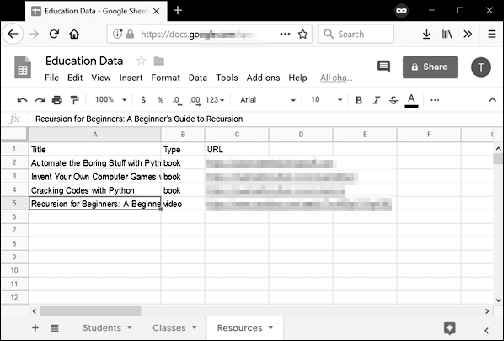

### 14.2　Spreadsheet对象

在Google电子表格中，一个“电子表格”可以包含多个“表”（也称为“工作表”），每个表都包含值的列和行。图14-4所示为一个名为“Education Data”的电子表格，其中包含3个表，分别为“Students”“Classes”和“Resources”。每张表的第一列标为A，第一行标为1。

<b class="my_markdown">图14-4　一个名为“Education Data”的电子表格，其中包含3个表</b>

虽然你的大部分工作会涉及修改 `Sheet` 对象，但你也可以修改 `Spreadsheet` 对象，正如你将在下一小节中看到的那样。

