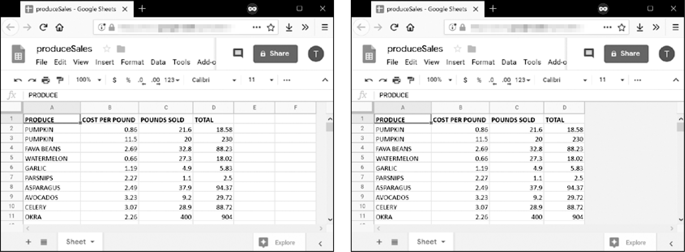

### 14.3.1　读取和写入数据

就像在Excel中一样，Google Sheets工作表也有包含数据的、成列成行的单元格。你可以使用方括号操作符来读取和写入这些单元格中的数据。例如，要创建一个新的电子表格并向其添加数据，请在交互式环境中输入以下内容：

```javascript
>>> import ezsheets
>>> ss = ezsheets.createSpreadsheet('My Spreadsheet')
>>> sheet = ss[0] # Get the first sheet in this spreadsheet.
>>> sheet.title
'Sheet1'
>>> sheet = ss[0]
>>> sheet['A1'] = 'Name' # Set the value in cell A1.
>>> sheet['B1'] = 'Age'
>>> sheet['C1'] = 'Favorite Movie'
>>> sheet['A1'] # Read the value in cell A1. 
'Name'
>>> sheet['A2'] # Empty cells return a blank string. 
''
>>> sheet[2, 1] # Column 2, Row 1 is the same address as B1.
'Age'
>>> sheet['A2'] = 'Alice'
>>> sheet['B2'] = 30
>>> sheet['C2'] = 'RoboCop'
```

这些指令能生成一个图14-5所示的Google Sheets电子表格。


<center class="my_markdown"><b class="my_markdown">图14-5　根据示例指令创建的电子表格</b></center>

多个用户可以同时刷新一个工作表。要刷新 `Sheet` 对象中的本地数据，请调用它的 `refresh()` 方法：

```javascript
>>> sheet.refresh()
```

当第一次加载 `Spreadsheet` 对象时， `Sheet` 对象中的所有数据都会被加载，所以数据可以立即读取。但是，将值写入在线电子表格需要连接网络，需要大约1秒的时间。如果你有成千上万个单元格需要更新，那么一次更新一个单元格可能会相当慢。

#### 列和行寻址

单元格寻址在Google Sheets 中的工作原理就像在Excel中的一样。唯一的区别在于，与 Python 的基于0的列表索引不同，Google Sheets的列和行基于1：第一个列或行位于索引1，而不是0。你可以用 `convertAddress()` 函数将 `'A2'` 字符串式的地址转换为（列、行）元组风格的地址（反之亦然）。 `getColumnLetterOf()` 和 `getColumnNumberOf()` 函数也会完成字母和数字之间的列地址转换。在交互式环境中输入以下内容：

```javascript
>>> import ezsheets
>>> ezsheets.convertAddress('A2') # Converts addresses...
(1, 2)
>>> ezsheets.convertAddress(1, 2) # ...and converts them back, too.
'A2'
>>> ezsheets.getColumnLetterOf(2)
'B'
>>> ezsheets.getColumnNumberOf('B')
2
>>> ezsheets.getColumnLetterOf(999)
'ALK'
>>> ezsheets.getColumnNumberOf('ZZZ')
18278
```

如果你在源代码中输入地址，那么使用 `'A2'` 字符串式的地址很方便。但是，如果你要在一个地址范围内循环使用（列、行）元组样式的地址，并且需要列的数字形式，那么使用（列、行）元组样式的地址就很方便。使用  `convertAddress()` 、 `getColumnLetterOf()` 和 `getColumnNumberOf()` 函数有助于你在需要的两种格式之间进行转换。

#### 读取和写入整列和整行的内容

如前所述，一次写一个单元格的数据往往会花费太多时间。幸运的是，EZSheets有 `Sheet` 方法可以同时读写整列和整行。 `getColumn()` 、 `getRow()` 、 `updateColumn()` 和 `updateRow()` 方法将分别读取和写入列和行。这些方法会向Google Sheets服务器发出请求，以更新电子表格，因此它们需要你连接到因特网。在本节的例子中，我们将上传上一章中的produceSales.xlsx到Google Sheets。前8行如表14-1所示。

<center class="my_markdown"><b class="my_markdown">表14-1　produceSales.xlsx电子表格的前8行</b></center>

| A | B | C | D |
| :-----  | :-----  | :-----  | :-----  | :-----  | :-----  |
| 1 | PRODUCE | COST PER POUND | POUNDS SOLD | TOTAL |
| 2 | Potatoes | 0.86 | 21.6 | 18.58 |
| 3 | Okra | 2.26 | 38.6 | 87.24 |
| 4 | Fava beans | 2.69 | 32.8 | 88.23 |
| 5 | Watermelon | 0.66 | 27.3 | 18.02 |
| 6 | Garlic | 1.19 | 4.9 | 5.83 |
| 7 | Parsnips | 2.27 | 1.1 | 2.5 |
| 8 | Asparagus | 2.49 | 37.9 | 94.37 |

要上传这个电子表格，请在交互式环境中输入以下内容：

```javascript
>>> import ezsheets
>>> ss = ezsheets.upload('produceSales.xlsx')
>>> sheet = ss[0]
>>> sheet.getRow(1)  #  The  first row  is row  1, not row  0.
['PRODUCE', 'COST PER POUND', 'POUNDS SOLD', 'TOTAL', '', '']
>>> sheet.getRow(2)
['Potatoes', '0.86', '21.6', '18.58', '', '']
>>> columnOne = sheet.getColumn(1)
>>> sheet.getColumn(1)
['PRODUCE', 'Potatoes', 'Okra', 'Fava beans', 'Watermelon', 'Garlic',
--snip--
>>> sheet.getColumn('A') # Same result as getColumn(1)
['PRODUCE', 'Potatoes', 'Okra', 'Fava beans', 'Watermelon', 'Garlic',
--snip--
>>> sheet.getRow(3)
['Okra', '2.26', '38.6', '87.24', '', '']
>>> sheet.updateRow(3, ['Pumpkin', '11.50', '20', '230'])
>>> sheet.getRow(3)
['Pumpkin', '11.50', '20', '230', '', '']
>>> columnOne = sheet.getColumn(1)
>>> for i, value in enumerate(columnOne):
...     # Make the Python list contain uppercase strings:
...     columnOne[i] = value.upper()
...
>>> sheet.updateColumn(1, columnOne) # Update the entire column in one
request.
```

`getRow()` 和 `getColumn()` 函数从特定行或列中的每一个单元格中获取数据，以作为一个值的列表。注意，空的单元格在列表中会变成空字符串值。你可以给 `getColumn()` 函数传递一个列号或字母，告诉它检索特定列的数据。上一个例子显示， `getColumn(1)` 和 `getColumn('A')` 返回的是同一个列表。

`updateRow()` 和 `updateColumn()` 函数用传入函数的值列表，分别覆盖该行或该列中的所有数据。在这个例子中，第3行最初包含了关于秋葵（okra）的信息，但是调用 `updateRow()` 函数会用 `pumpkin` 的数据来代替它。再次调用 `sheet.getRow(3)` ，查看第3行中的新值。

接下来，让我们更新produceSales电子表格。如果你有很多单元格需要更新，那么一次更新一个单元格会很慢。以一个列表的方式获取一列或一行，更新这个列表，然后用这个列表更新整列或整行，这会快得多，因为所有的更改都可以在一次请求中进行。

要一次性获得所有行，可以调用 `getRows()` 方法，它返回一个列表的列表。外层列表中的一个内层列表代表了工作表中一个单独的行。你可以修改这个数据结构中的值来改变部分行的产品名称、销售的磅数和总成本。然后在交互式环境中输入以下内容，将它传递给 `updateRows()` 方法：

```javascript
>>> rows = sheet.getRows() # Get every row in the spreadsheet.
>>> rows[0] # Examine the values in the first row.
['PRODUCE', 'COST PER POUND', 'POUNDS SOLD', 'TOTAL', '', '']
>>> rows[1]
['POTATOES', '0.86', '21.6', '18.58', '', '']
>>> rows[1][0] = 'PUMPKIN' # Change the produce name.
>>> rows[1]
['PUMPKIN', '0.86', '21.6', '18.58', '', '']
>>> rows[10]
['OKRA', '2.26', '40', '90.4', '', '']
>>> rows[10][2] = '400' # Change the pounds sold.
>>> rows[10][3] = '904' # Change the total.
>>> rows[10]
['OKRA', '2.26', '400', '904', '', '']
>>> sheet.updateRows(rows) # Update the online spreadsheet with the changes.
```

你可以在一次请求中更新整个工作表，方法是将 `getRows()` 返回的列表的列表传递给 `updateRows()` ，其中包含了对第1行和第10行的修改。

注意，Google Sheets中的行在结尾处有空字符串。这是因为上传的表的列数为6，但我们只有4列数据。你可以通过 `rowCount` 和 `columnCount` 属性读取表中的行数和列数，然后设置这些值，就可以改变表的大小：

```javascript
>>> sheet.rowCount # The number of rows in the sheet.
23758
>>> sheet.columnCount # The number of columns in the sheet.
6
>>> sheet.columnCount = 4 # Change the number of columns to 4.
>>> sheet.columnCount # Now the number of columns in the sheet is 4.
4
```

这些指令应删除produceSales电子表格的第5列和第6列，如图14-6所示。


<center class="my_markdown"><b class="my_markdown">图14-6　将列数改为4之前（左）和之后（右）的工作表</b></center>

根据官方的描述文档，Google Sheets电子表格可以有多达500万个单元格。但是，最好只用需要大小的电子表格，以减少更新和刷新数据所需的时间。

