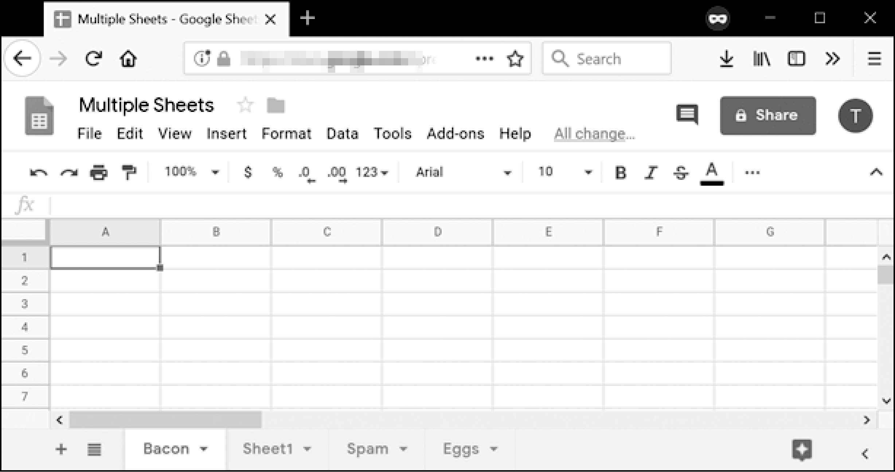

### 14.3.2　创建和删除工作表

所有的Google Sheets电子表格都是从一个名为Sheet1的单张表开始的。可以用 `createSheet()` 方法将额外的工作表添加到工作表列表的末尾，并传入一个字符串作为新工作表的标题。可选的第二个参数可以指定新工作表的整数索引。要创建一个电子表格，然后向其中添加新的工作表，请在交互式环境中输入以下内容：

```javascript
>>> import ezsheets
>>> ss = ezsheets.createSpreadsheet('Multiple Sheets')
>>> ss.sheetTitles
('Sheet1',)
>>> ss.createSheet('Spam') # Create a new sheet at the end of the list of sheets.
<Sheet sheetId=2032744541, title='Spam', rowCount=1000, columnCount=26>
>>> ss.createSheet('Eggs')  # Create another new sheet.
<Sheet sheetId=417452987, title='Eggs', rowCount=1000, columnCount=26>
>>> ss.sheetTitles
('Sheet1', 'Spam', 'Eggs')
>>> ss.createSheet('Bacon', 0) # Create a sheet at index 0 in the list of sheets.
<Sheet sheetId=814694991, title='Bacon', rowCount=1000, columnCount=26>
>>> ss.sheetTitles
('Bacon', 'Sheet1', 'Spam', 'Eggs')
```

这些指令在电子表格中增加了3个新表：Bacon、Spam和Eggs（除了默认的 Sheet1之外）。电子表格中的工作表是有序的，新的工作表会排在列表的最后，除非你向 `createSheet()` 传入第二个参数来指定工作表的索引。在这里，你在索引0处创建了名为Bacon的表，使Bacon成为电子表格中的第一个表，并将其他3个表向后移了一个位置。这与列表方法 `insert()` 的行为类似。

你可以看到屏幕底部的标签页上的新表，如图14-7所示。


<center class="my_markdown"><b class="my_markdown">图14-7 添加Spam、Eggs和Bacon表后的“多工作表”电子表格</b></center>

`Sheet` 对象的 `delete()` 方法将从电子表格中删除该工作表。如果你想保留该工作表，但删除它所包含的数据，请调用 `clear()` 方法来清除所有单元格，使之成为空白工作表。在交互式环境中输入以下内容：

```javascript
>>> ss.sheetTitles
('Bacon', 'Sheet1', 'Spam', 'Eggs')
>>> ss[0].delete()           # Delete the sheet at index 0: the "Bacon" sheet.
>>> ss.sheetTitles
('Sheet1', 'Spam', 'Eggs')
>>> ss['Spam'].delete()      # Delete the "Spam" sheet.
>>> ss.sheetTitles
('Sheet1', 'Eggs')
>>> sheet = ss['Eggs']      # Assign a variable to the "Eggs" sheet.
>>> sheet.delete()            # Delete the "Eggs" sheet.
>>> ss.sheetTitles
('Sheet1',)
>>> ss[0].clear()            # Clear all the cells on the "Sheet1" sheet.
>>> ss.sheetTitles           # The "Sheet1" sheet is empty but still exists.
('Sheet1',)
```

删除工作表是永久性的，没有办法恢复数据。但是，你可以使用 `copyTo()` 方法将表复制到另一个电子表格中，从而进行备份，这将在下一小节中解释。

