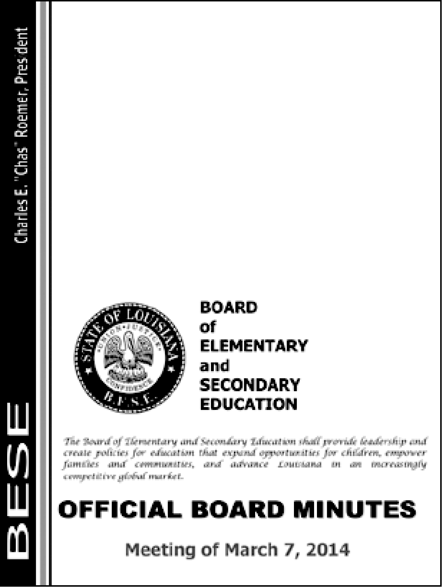

### 15.1.1　从PDF提取文本

`PyPDF2` 没有办法从PDF文档中提取图像、图表或其他媒体，但它可以提取文本，并将文本返回为Python字符串。为了学习 `PyPDF2` 的工作原理，我们将它用于一个示例PDF，如图15-1所示。


<center class="my_markdown"><b class="my_markdown">图15-1　PDF页面，我们将从中提取文本</b></center>

从异步社区本书对应页面下载这个PDF文档，并在交互式环境中输入以下代码：

```javascript
 >>> import PyPDF2
 >>> pdfFileObj = open('meetingminutes.pdf', 'rb')
 >>> pdfReader = PyPDF2.PdfFileReader(pdfFileObj)
❶ >>> pdfReader.numPages
19
❷ >>> pageObj = pdfReader.getPage(0)
❸ >>> pageObj.extractText()
  'OOFFFFIICCIIAALL  BBOOAARRDD  MMIINNUUTTEESS   Meeting of March 7,
  2015    \n     The Board of Elementary and Secondary Education shall
  provide leadership and create policies for education that expand opportunities
  for children, empower  families and communities, and advance Louisiana in an
  increasingly competitive global market. BOARD   of ELEMENTARY and  SECONDARY
  EDUCATION  '
 >>> pdfFileObj.close()
```

首先导入 `PyPDF2` 模块。然后以读二进制模式打开meetingminutes.pdf，并将它保存在 `pdfFileObj` 中。为了取得表示这个PDF的 `PdfFileReader` 对象，请调用 `PyPDF2.PdfFileReader()` 并向它传入 `pdfFileObj` 。将这个 `PdfFileReader` 对象保存在 `pdfReader` 中。

该文档的总页数保存在 `PdfFileReader` 对象的 `numPages` 属性中❶。示例PDF文档有19页，但我们只提取第一页的文本。

要从一页中提取文本，需要通过 `PdfFileReader` 对象取得一个 `Page` 对象，它表示PDF中的一页。可以调用 `PdfFileReader` 对象的 `getPage()` 方法❷，向它传入感兴趣的页码（在我们的例子中是0），从而取得 `Page` 对象。

`PyPDF2` 在取得页面时使用从0开始的索引：第一页是0页，第二页是1页，以此类推。事情总是这样，即使文档中页面的页码不同。例如，假定你的PDF是从一个较长的报告中抽取出的3页，它的页码分别是42、43和44。要取得这个文档的第一页，需要调用 `pdfReader.getPage(0)` ，而不是 `getPage(42)` 或 `getPage(1)` 。

在取得 `Page` 对象后，调用它的 `extractText()` 方法，以返回该页文本的字符串❸。文本提取并不完美：该PDF中的文本Charles E. “Chas” Roemer, President在函数返回的字符串中消失了，而且空格有时候也会没有。但是，这种近似的PDF文本内容，可能对你的程序来说已经足够了。

