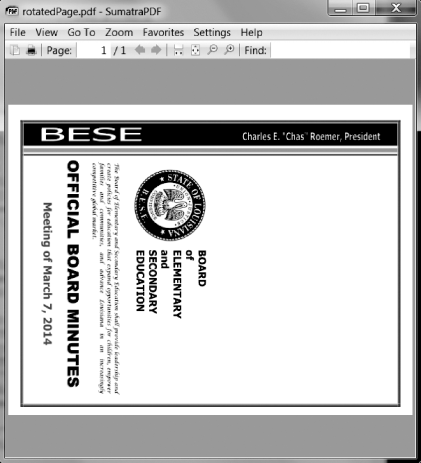
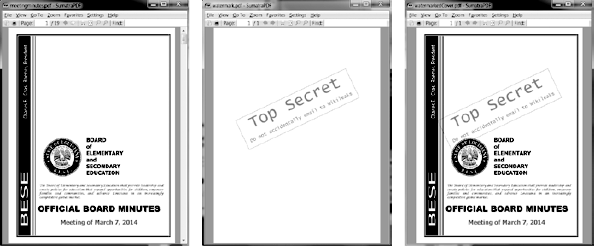

### 15.1.3　创建PDF

在 `PyPDF2` 中，与 `PdfFileReader` 对象相对的是 `PdfFileWriter` 对象，它可以创建一个新的PDF文档。但 `PyPDF2` 不能将任意文本写入PDF，不像Python可以写入纯文本文件。 `PyPDF2` 写入PDF的能力，仅限于从其他PDF中复制页面、旋转页面、重叠页面和加密文件。

`PyPDF2` 不允许直接编辑PDF。必须创建一个新的PDF，然后从已有的文档复制内容。本节的例子将遵循这种一般方式。

1．打开一个或多个已有的PDF（源PDF），得到 `PdfFileReader` 对象。

2．创建一个新的 `PdfFileWriter` 对象。

3．将页面从 `PdfFileReader` 对象复制到 `PdfFileWriter` 对象中。

4．利用 `PdfFileWriter` 对象写入输出的PDF。

创建一个 `PdfFileWriter` 对象，只是在Python中创建了一个代表PDF文档的值，这并没有创建实际的PDF文件。要实际生成文件，必须调用 `PdfFileWriter` 对象的 `write()` 方法。

`write()` 方法接收一个普通的 `File` 对象，它以写二进制的模式打开。你可以用两个参数调用Python的 `open()` 函数，得到这样的 `File` 对象：一个是要 打开的PDF文件名字符串；另一个是 `'wb'` ，表明文件应该以写二进制的模式打开。

如果这听起来有些令人困惑，不用担心，在接下来的代码示例中你会看到这种工作方式。

#### 复制页面

可以利用 `PyPDF2` ，从一个PDF文档复制页面到另一个PDF文档。这让你能够组合多个PDF文档，去除不想要的页面或调整页面的次序。

从异步社区本书对应页面下载meetingminutes.pdf和meetingminutes2.pdf，放在当前工作目录中。在交互式环境中输入以下代码：

```javascript
 >>> import PyPDF2
 >>> pdf1File = open('meetingminutes.pdf', 'rb')
 >>> pdf2File = open('meetingminutes2.pdf', 'rb')
❶ >>> pdf1Reader = PyPDF2.PdfFileReader(pdf1File)
❷ >>> pdf2Reader = PyPDF2.PdfFileReader(pdf2File)
❸ >>> pdfWriter = PyPDF2.PdfFileWriter()
 >>> for pageNum in range(pdf1Reader.numPages):
 ❹ pageObj = pdf1Reader.getPage(pageNum)
 ❺ pdfWriter.addPage(pageObj)
 >>> for pageNum in range(pdf2Reader.numPages):
 ❹ pageObj = pdf2Reader.getPage(pageNum)
 ❺ pdfWriter.addPage(pageObj)
❻ >>> pdfOutputFile = open('combinedminutes.pdf', 'wb')
 >>> pdfWriter.write(pdfOutputFile)
 >>> pdfOutputFile.close()
 >>> pdf1File.close()
 >>> pdf2File.close()
```

以读二进制的模式打开两个PDF文档，将得到的两个 `File` 对象保存在 `pdf1File` 和 `pdf2File` 中。调用 `PyPDF2.PdfFileReader()` ，传入 `pdf1File` ，得到一个表示 `meetingminutes. pdf` 的 `PdfFileReader` 对象❶。再次调用 `PyPDF2.PdfFileReader()` ，传入 `pdf2File` ，得到一个表示 `meetingminutes2. pdf` 的 `PdfFileReader` 对象❷。然后创建一个新的 `PdfFileWriter` 对象，它表示一个空白的PDF文档❸。

接下来，从两个源PDF复制所有的页面，将它们添加到 `PdfFileWriter` 对象。在 `PdfFileReader` 对象上调用 `getPage()` ，取得 `Page` 对象❹。然后将这个 `Page` 对象传递给 `PdfFileWriter` 的 `addPage()` 方法❺。这些步骤先是针对 `pdf1Reader` 进行，然后针对 `pdf2Reader` 进行。在完成复制页面后，向 `PdfFileWriter` 的 `write()` 方法传入一个 `File` 对象，写入一个新的PDF文档，其名为 `combinedminutes.pdf` ❻。


**注意：**
`PyPDF2` 不能在 `PdfFileWriter` 对象中间插入页面， `addPage()` 方法只能够在末尾添加页面。


现在你创建了一个新的PDF文档，将来自 `meetingminutes.pdf` 和 `meetingminutes2.pdf` 的页面组合在一个文档中。要记住，传递给 `PyPDF2. PdfFileReader()` 的 `File` 对象需要以读二进制的模式打开，即使用 `'rb'` 作为 `open()` 的第二个参数。类似，传入 `PyPDF2. PdfFileWriter()` 的 `File` 对象需要以写二进制的模式打开，即使用 `'wb'` 。

#### 旋转页面

利用 `rotateClockwise()` 和 `rotateCounterClockwise()` 方法，PDF文档的页面可以旋转90度的整数倍。向这些方法传入整数90、180或270就可以了。在交互式环境中输入以下代码，同时将 `meetingminutes.pdf` 放在当前工作目录中：

```javascript
 >>> import PyPDF2
 >>> minutesFile = open('meetingminutes.pdf', 'rb')
 >>> pdfReader = PyPDF2.PdfFileReader(minutesFile)
❶ >>> page = pdfReader.getPage(0)
❷ >>> page.rotateClockwise(90)
   {'/Contents': [IndirectObject(961, 0), IndirectObject(962, 0),
   --snip--
   }
 >>> pdfWriter = PyPDF2.PdfFileWriter()
 >>> pdfWriter.addPage(page)
❸ >>> resultPdfFile = open('rotatedPage.pdf', 'wb')
 >>> pdfWriter.write(resultPdfFile)
 >>> resultPdfFile.close()
 >>> minutesFile.close()
```

这里，我们使用 `getPage(0)` 来选择PDF的第一页❶，然后对该页调用 `rotate Clockwise(90)` ❷。我们将旋转过的页面写入一个新的PDF文档，并保存为 `rotatedPage.pdf` ❸。

得到的 PDF 文档有一个页面，顺时针旋转了 90 度，如图15-2所示。 `rotateClockwise()` 和 `rotateCounterClockwise()` 的返回值包含许多信息，你可以忽略。


<center class="my_markdown"><b class="my_markdown">图15-2 rotatedPage.pdf文档，页面顺时针旋转了90度</b></center>

#### 叠加页面

`PyPDF2` 也可以将一页的内容叠加到另一页上，这可以用来在页面上添加公司标志、时间戳或水印。利用Python，可以很容易为多个文件添加水印，并且只针对程序指定的页面添加。

从异步社区本书对应页面下载watermark.pdf，将它和meetingminutes.pdf一起放在当前工作目录中。然后在交互式环境中输入以下代码：

```javascript
 >>> import PyPDF2
 >>> minutesFile = open('meetingminutes.pdf', 'rb')
❶ >>> pdfReader = PyPDF2.PdfFileReader(minutesFile)
❷ >>> minutesFirstPage = pdfReader.getPage(0)
❸ >>> pdfWatermarkReader = PyPDF2.PdfFileReader(open('watermark.pdf', 'rb'))
❹ >>> minutesFirstPage.mergePage(pdfWatermarkReader.getPage(0))
❺ >>> pdfWriter = PyPDF2.PdfFileWriter()
❻ >>> pdfWriter.addPage(minutesFirstPage)
❼ >>> for pageNum in range(1, pdfReader.numPages): 
 pageObj = pdfReader.getPage(pageNum)
 pdfWriter.addPage(pageObj)
 >>> resultPdfFile = open('watermarkedCover.pdf', 'wb')
 >>> pdfWriter.write(resultPdfFile)
 >>> minutesFile.close()
 >>> resultPdfFile.close()
```

这里我们生成了meetingminutes.pdf的 `PdfFileReader` 对象❶。调用 `getPage(0)` 以取得第一页的 `Page` 对象，并将它保存在 `minutesFirstPage` 中❷。然后生成  `watermark.pdf`  的 `PdfFileReader` 对象❸，并在 `minutesFirstPage` 上调用 `mergePage()` ❹。传递给 `mergePage()` 的参数是watermark.pdf第一页的 `Page` 对象。

既然我们已经在 `minutesFirstPage` 上调用了 `mergePage()` ，那么 `minutesFirstPage` 就代表加了水印的第一页。我们创建一个 `PdfFileWriter` 对象❺，并加入加了水印的第一页❻。然后循环遍历meetingminutes.pdf的剩余页面，将它们添加到 `PdfFileWriter` 对象中❼。最后，我们打开一个新的 PDF 文档watermarkedCover.pdf，并将 `PdfFileWriter` 的内容写入该文档。

图15-3所示为结果。新的 PDF 文档watermarkedCover.pdf包含meetingminutes. pdf的全部内容，并在第一页加了水印。


<center class="my_markdown"><b class="my_markdown">图15-3 最初的PDF（左边）、水印PDF（中间）以及合并的PDF（右边）</b></center>

#### 加密PDF

`PdfFileWriter` 对象也可以为PDF文档加密。在交互式环境中输入以下代码：

```javascript
 >>> import PyPDF2
 >>> pdfFile = open('meetingminutes.pdf', 'rb')
 >>> pdfReader = PyPDF2.PdfFileReader(pdfFile)
 >>> pdfWriter = PyPDF2.PdfFileWriter()
 >>> for pageNum in range(pdfReader.numPages): 
 pdfWriter.addPage(pdfReader.getPage(pageNum))
❶ >>> pdfWriter.encrypt('swordfish')
 >>> resultPdf = open('encryptedminutes.pdf', 'wb')
 >>> pdfWriter.write(resultPdf)
 >>> resultPdf.close()
```

在调用 `write()` 方法保存文档之前，调用 `encrypt()` 方法，传入口令字符串❶。PDF可以有一个“用户口令”（允许查看这个PDF）和一个“拥有者口令”（允许设置打印、注释、提取文本和其他功能的许可）。用户口令和拥有者口令分别是 `encrypt()` 的第一个和第二个参数。如果只给 `encrypt()` 传入一个字符串，那么该字符串将同时作为两个口令使用。

在这个例子中，我们将meetingminutes.pdf的页面复制到 `PdfFileWriter` 对象。用口令swordfish加密了 `PdfFileWriter` ，打开了一个名为encryptedminutes.pdf的新PDF，并将 `PdfFileWriter` 的内容写入新PDF。任何人要查看encryptedminutes.pdf，都必须输入这个口令。在确保文件的副本被正确加密后，你可能会删除原来的未加密的meetingminutes.pdf文档。

