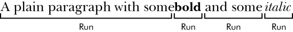

### 15.3　Word文档

利用 `python-docx` 模块，Python可以创建和修改Word文档，Word文档带有.docx文件扩展名。运行 `pip install --user -U python-docx==0.8.10` 可以安装该模块（附录A介绍了安装第三方模块的细节）。

注意：在第一次用pip安装 `python-docx` 时，注意要安装 `python-docx` ，而不是 `docx` 。安装名称 `docx` 是指另一个模块，本书没有介绍。但是，在导入 `python-docx` 模块时，需要执行 `import docx` ，而不是 `import python-docx` 。

如果你没有Word软件，那么LibreOffice Writer和OpenOffice Writer都是免费的替代软件，它们可以在Windows操作系统、macOS和Linux操作系统上打开.docx文档。尽管有针对macOS的Word版本，但本章将使用Windows操作系统的Word版本。

和纯文本相比，.docx文档有很多结构。这些结构在 `python-docx` 中用3种不同的类型来表示。在最高一层， `Document` 对象表示整个文档。 `Document` 对象包含一个 `Paragraph` 对象的列表表示文档中的段落（用户在Word文档中输入时，如果按回车键，新的段落就开始了）。每个 `Paragraph` 对象都包含一个 `Run` 对象的列表。图15-4所示的单句段落有4个 `Run` 对象。

<b class="my_markdown">图15-4　一个 `Paragraph` 对象中识别的 `Run` 对象</b>

Word文档中的文本不仅仅是字符串，它还包含与之相关的字体、大小、颜色和其他样式信息。在Word文档中，样式是这些属性的集合。一个Run对象是相同样式文本的延续。当文本样式发生改变时，就需要一个新的Run对象。

