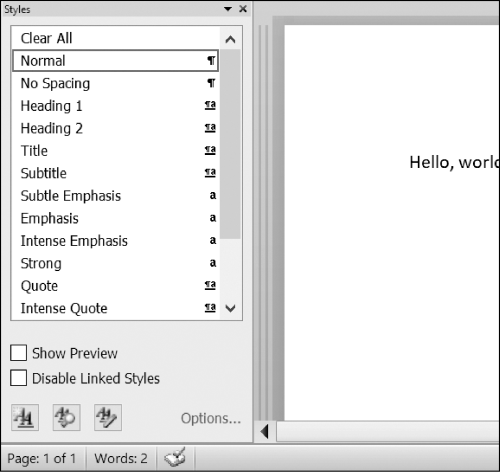

### 15.3.3　设置Paragraph和Run对象的样式

在Windows操作系统的Word中，你可以按Ctrl-Alt-Shift-S快捷键显示样式窗口并查看样式，如图15-5所示。在macOS上，可以选择ViewStyles菜单项查看样式窗口。


<center class="my_markdown"><b class="my_markdown">图15-5　在Windows操作系统上按Ctrl-Alt-Shift-S快捷键，显示样式窗口</b></center>

Word和其他文字处理软件一样通过利用样式来保持类似类型的文本在视觉展现上一致，这还易于修改。例如，也许你希望将内容段落设置为11点、Times New Roman、左对齐、右边不对齐的文本。可以用这些设置创建一种样式，将它赋给所有的文本段落。如果稍后想改变文档中所有内容段落的展现形式，只要改变这种样式，那么所有段落都会自动更新。

对于Word文档，有3种类型的样式：“段落样式”可以应用于 `Paragraph` 对象，“字符样式”可以应用于 `Run` 对象，“链接的样式”可以应用于这两种对象。可以将 `Paragraph` 和 `Run` 对象的 `style` 属性设置为一个字符串，从而设置样式。这个字符串应该是一种样式的名称。如果 `style` 被设置为 `None` ，就没有样式与 `Paragraph` 或 `Run` 对象关联。

默认Word样式的字符串如下：

```javascript
'Normal'           'Heading 5'          'List Bullet'            'List Paragraph'
'Body Text'        'Heading 6'          'List Bullet 2'          'MacroText'
'Body Text 2'      'Heading 7'          'List Bullet 3'          'No Spacing'
'Body Text 3'       'Heading 8'          'List Continue'           'Quote'
'Caption'          'Heading 9'          'List Continue 2'         'Subtitle'
'Heading 1'         'Intense Quote'      'List Continue 3'        'TOC Heading'
'Heading 2'         'List'               'List Number '            'Title'
'Heading 3'         'List 2'             'List Number 2'
'Heading 4'         'List 3'             'List Number 3'
```

如果对 `Run` 对象应用链接的样式，那么需要在样式名称末尾加上 `'Char'` 。例如，对 `Paragraph` 对象设置Quote链接的样式，应该使用 `paragraphObj.style = 'Quote'` ；但对于 `Run` 对象，应该使用 `runObj.style = 'QuoteChar'` 。

在当前版本的python-docx (0.8.10)中，只能使用默认的Word样式以及打开的文件中已有的样式，不能创建新的样式，但这一点在将来的python-docx版本中可能会改变。

