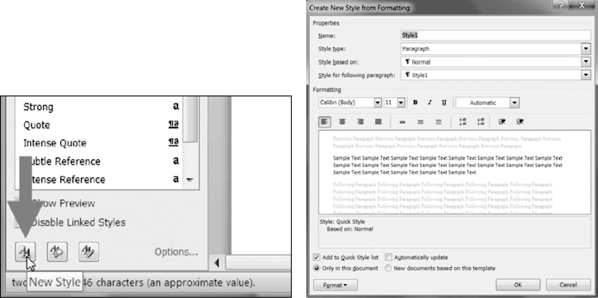

### 15.3.4　创建带有非默认样式的Word文档

如果想要创建的Word文档使用默认样式以外的样式，就需要打开一个空白Word文档，通过单击样式窗口底部的New Style按钮来自己创建样式，图15-6所示为Windows操作系统的情形。

<b class="my_markdown">图15-6　New Style按钮（左边）和“Create New Style from Formatting”对话框（右边）</b>

这将打开“Create New Style from Formatting”对话框，在这里可以输入新样式。然后回到交互式环境，用 `docx.Document()` 打开这个空白Word文档，将它作为Word文档的基础。这种样式的名称现在就可以被 `python-docx` 使用了。

