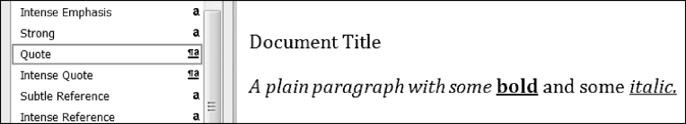

### 15.3.5　Run属性

通过 `text` 属性，Run可以进一步设置样式。每个属性都可以被设置为3个值之一： `True` （该属性总是启用，不论其他样式是否应用于该Run）、 `False` （该属性总是禁用）或 `None` （默认使用该 `Run` 被设置的任何属性）。

表15-1列出了可以在 `Run` 对象上设置的 `text` 属性。

<center class="my_markdown"><b class="my_markdown">表15-1　 `Run` 对象的 `text` 属性</b></center>

| 属性 | 描述 |
| :-----  | :-----  | :-----  | :-----  |
| `bold` | 文本以粗体出现 |
| `italic` | 文本以斜体出现 |
| `underline` | 文本带下划线 |
| `strike` | 文本带删除线 |
| `double_strike` | 文本带双删除线 |
| `all_caps` | 文本以大写字母出现 |
| `small_caps` | 文本以大写字母出现，但大小和小写字母一样 |
| `shadow` | 文本带阴影 |
| `outline` | 文本以轮廓线出现，而不是以实心出现 |
| `rtl` | 文本从右至左书写 |
| `imprint` | 文本以刻入页面的方式出现 |
| `emboss` | 文本以凸出页面的方式出现 |

例如，为了改变demo.docx的样式，在交互式环境中输入以下代码：

```javascript
>>> import docx
>>> doc = docx.Document('demo.docx')
>>> doc.paragraphs[0].text
'Document Title'
>>> doc.paragraphs[0].style # The exact id may be different:
_ParagraphStyle('Title') id: 3095631007984
>>> doc.paragraphs[0].style = 'Normal'
>>> doc.paragraphs[1].text
'A plain paragraph with some bold and some italic'
>>> (doc.paragraphs[1].runs[0].text, doc.paragraphs[1].runs[1].text, doc.
paragraphs[1].runs[2].text, doc.paragraphs[1].runs[3].text)
('A plain paragraph with some ', 'bold', ' and some ', 'italic')
>>> doc.paragraphs[1].runs[0].style = 'QuoteChar'
>>> doc.paragraphs[1].runs[1].underline = True
>>> doc.paragraphs[1].runs[3].underline = True
>>> doc.save('restyled.docx')
```

这里，我们使用了 `text` 和 `style` 属性，以便容易地看到文档的段落中有什么。我们可以看到，很容易将段落划分成 `Run` ，并单独访问每个 `Run` 。所以我们取得了第二段中的第一、第二和第四个 `Run` ，设置每个 `Run` 的样式，并将结果保存到一个新文档。

文件顶部的单词Document Title将具有Normal样式，而不是Title样式。针对文本A plain paragraph的 `Run` 对象将具有QuoteChar样式。针对单词bold和italic的两个 `Run` 对象，它们的 `underline` 属性设置为 `True` 。图15-7所示为文件中段落和 `Run` 的样式的展现形式。


<center class="my_markdown"><b class="my_markdown">图15-7　restyled.docx文档</b></center>

