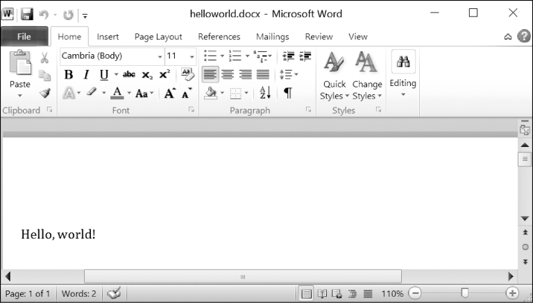
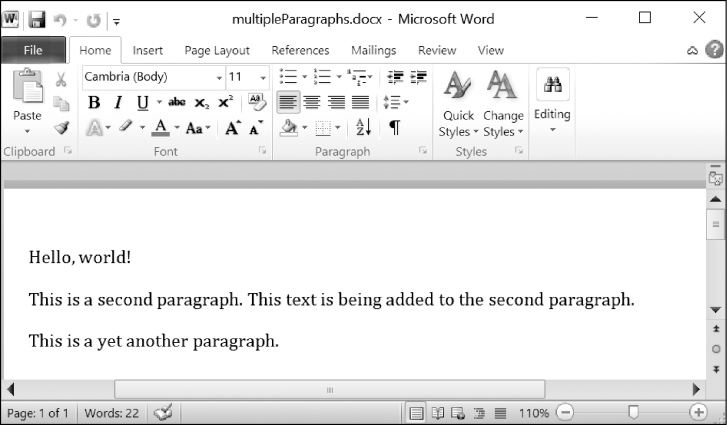

### 15.3.6　写入Word文档

在交互式环境中输入以下代码：

```javascript
>>> import docx
>>> doc = docx.Document()
>>> doc.add_paragraph('Hello, world!')
<docx.text.Paragraph object at 0x0000000003B56F60>
>>> doc.save('helloworld.docx')
```

要创建自己的.docx文档，就调用 `docx.Document()` ，返回一个新的、空白的Word Document对象。 `Document` 对象的 `add_paragraph()` 方法将一段新文本添加到文档中，并返回添加的 `Paragraph` 对象的引用。在添加完文本之后，向 `Document` 对象的 `save()` 方法传入一个文件名字符串，将 `Document` 对象保存到文档。

这将在当前工作目录中创建一个文档，其名为helloworld.docx。如果打开它，就像图15-8所示的样子。


<center class="my_markdown"><b class="my_markdown">图15-8　利用 `add_paragraph('Hello world!')` 创建的Word文档</b></center>

再次调用 `add_paragraph()` 方法和新的段落文本来添加段落。或者，要在已有段落的末尾添加文本，可以调用 `Paragraph` 对象的 `add_run()` 方法，以向它传入一个字符串。在交互式环境中输入以下代码：

```javascript
>>> import docx
>>> doc = docx.Document()
>>> doc.add_paragraph('Hello world!')
<docx.text.Paragraph object at 0x000000000366AD30>
>>> paraObj1 = doc.add_paragraph('This is a second paragraph.')
>>> paraObj2 = doc.add_paragraph('This is a yet another paragraph.')
>>> paraObj1.add_run(' This text is being added to the second paragraph.')
<docx.text.Run object at 0x0000000003A2C860>
>>> doc.save('multipleParagraphs.docx')
```

得到的文本如图15-9所示。请注意，文本This text is being added to the second paragraph.被添加到 `paraObj1` 中的 `Paragraph` 对象中，它是添加到 `doc` 中的第二段。 `add_paragraph()` 和 `add_run()` 分别返回 `Paragraph` 和 `Run` 对象，这样你就不必多花一步来提取它们。


<center class="my_markdown"><b class="my_markdown">图15-9　添加了多个 `Paragraph` 和 `Run` 对象的文档</b></center>

要记住，对于 `python-docx` 的0.8.10版本，新的 `Paragraph` 对象只能添加在文档的末尾，新的 `Run` 对象只能添加在 `Paragraph` 对象的末尾。

可以再次调用 `save()` 方法，保存所做的变更。

`add_paragraph()` 和 `add_run()` 都接收可选的第二个参数，它是表示 `Paragraph` 或 `Run` 对象样式的字符串。例如：

```javascript
>>> doc.add_paragraph('Hello, world!', 'Title')
```

这一行添加了一段，文本是Hello, world!，样式是Title。

