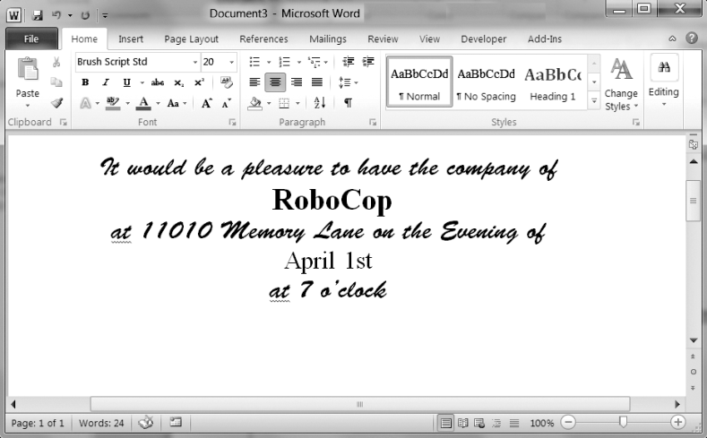

### 15.7.2　定制邀请函，保存为Word文档

假设你有一个客人名单的文本文件。这个guests.txt文件每行有一个名字，像下面这样：

```javascript
Prof. Plum
Miss Scarlet
Col. Mustard
Al Sweigart
RoboCop
```

写一个程序，生成定制邀请函的Word文档，如图15-11所示。


<center class="my_markdown"><b class="my_markdown">图15-11　定制的邀请函脚本生成的Word文档</b></center>

因为 `python-docx` 只能使用Word文档中已经存在的样式，所以你必须先将这些样式添加到一个空白Word文档中，然后用 `python-docx` 打开该文档。在生成的Word文档中，每份邀请函应该占据一页，因此在每份邀请函的最后一段调用 `add_break()` 以添加分页符。这样，你只需要打开一份Word文档，就能打印所有的邀请函。

你可以从异步社区本书对应页面下载示例guests.txt文件。

