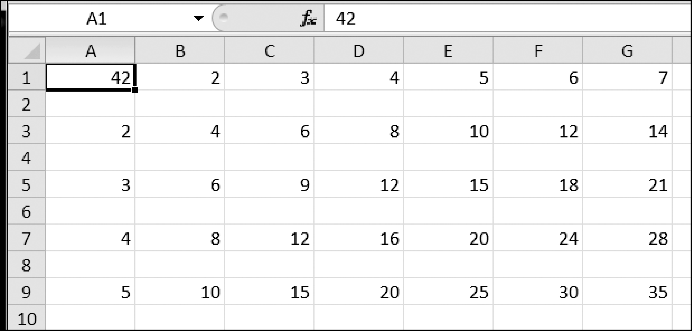

### 16.1.3　writer对象

`writer` 对象让你将数据写入 CSV 文件。要创建一个 `writer` 对象，就使用 `csv.writer()` 函数。在交互式环境中输入以下代码：

```javascript
   >>> import csv
❶  >>> outputFile = open('output.csv', 'w', newline='')
❷  >>> outputWriter = csv.writer(outputFile)
   >>> outputWriter.writerow(['spam', 'eggs', 'bacon', 'ham'])
   21
   >>> outputWriter.writerow(['Hello, world!', 'eggs', 'bacon', 'ham'])
   32
   >>> outputWriter.writerow([1, 2, 3.141592, 4])
   16
   >>> outputFile.close()
```

首先调用 `open()` 并传入 `'w'` ，以写模式打开一个文件❶。这将创建对象。然后将它传递给 `csv.writer()` ❷来创建一个 `writer` 对象。

在Windows操作系统上，需要为 `open()` 函数的 `newline` 关键字参数传入一个空字符串。这样做的技术原理超出了本书的范围，此处不予讨论。如果忘记设置 `newline` 关键字参数，那么output.csv中的行距将有两倍，如图16-1所示。


<center class="my_markdown"><b class="my_markdown">图16-1 如果你在 `open()` 中忘记设置 `newline=''` 关键字参数，CSV文件将有两倍行距</b></center>

`writer` 对象的 `writerow()` 方法接收一个列表参数。列表中的每个词放在输出的CSV文件中的一个单元格中。 `writerow()` 函数的返回值是写入文件的这一行的字符数（包括换行符）。

这段代码生成的文件像下面这样：

```javascript
spam,eggs,bacon,ham
"Hello, world!",eggs,bacon,ham
1,2,3.141592,4
```

请注意，在CSV文件中， `writer` 对象使用双引号自动转义了 `'Hello, world!'` 中的逗号。 `csv` 模块让你不必自己处理这些特殊情况。

