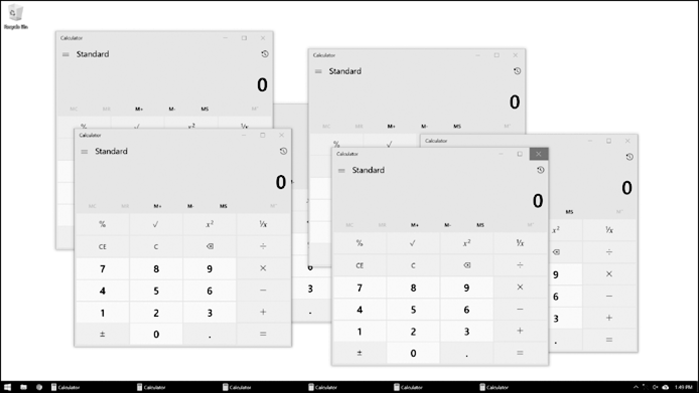

### 17.8　从Python启动其他程序

利用内置的 `subprocess` 模块中的 `Popen()` 函数，Python程序可以启动计算机中的其他程序（ `Popen()` 函数名中的P表示process，即进程）。如果你打开了一个应用程序的多个实例，那么每个实例都是同一个程序的不同进程。例如，如果你同时打开了Web浏览器的多个窗口，那么每个窗口都是Web浏览器程序的不同进程。图17-1所示是同时打开多个计算器进程的例子。


<center class="my_markdown"><b class="my_markdown">图17-1　相同的计算器程序，6个正在运行的进程</b></center>

每个进程可以有多个线程。不像线程，进程无法直接读写另一个进程的变量。如果你认为多线程程序是多个手指在追踪源代码，那么同一个程序打开多个进程就像有一个朋友拿着程序源代码的独立副本。你们都独立地执行相同的程序。

如果想在Python脚本中启动一个外部程序，就将该程序的文件名传递给 `subprocess.Popen()` （在Windows操作系统中，右键单击该应用程序的开始菜单，然后选择“属性”，查看应用程序的文件名。在macOS上，按住Ctrl键单击该应用程序并选择Show Package Contents，找到可执行文件的路径）。 `Popen()` 函数随后将立即返回。请记住，启动的程序和你的Python程序不在同一线程中运行。

在Windows操作系统上，在交互式环境中输入以下代码：

```javascript
>>> import subprocess
>>> subprocess.Popen('C:\\Windows\\System32\\calc.exe')
<subprocess.Popen object at 0x0000000003055A58>
```

在Ubuntu Linux操作系统上，可以输入以下代码：

```javascript
>>> import subprocess
>>> subprocess.Popen('/snap/bin/gnome-calculator')
<subprocess.Popen object at 0x7f2bcf93b20>
```

在macOS上，过程稍有不同。参见17.8.5小节“用默认的应用程序打开文件”。

返回值是一个 `Popen` 对象，它有两个有用的方法： `poll()` 和 `wait()` 。

可以认为 `poll()` 方法是反复问你的司机“我们还没到吗？”，直到你们到达为止。如果这个进程在 `poll()` 调用时仍在运行，那么 `poll()` 方法就返回 `None` 。如果该程序已经终止，那么它会返回该进程的整数“退出代码”。退出代码用于说明进程是无错终止（退出代码为 `0` ），还是一个错误导致终止（退出代码非 `0` ，通常为 `1` ，但可能根据程序而不同）。

`wait()` 方法就像是等着你的司机到达你们的目的地。 `wait()` 方法将阻塞，直到启动的进程终止。如果你希望你的程序暂停直到用户完成其他程序，这非常有用。 `wait()` 的返回值是进程的整数“退出代码”。

在Windows操作系统上，在交互环境中输入以下代码。请注意， `wait()` 的调用将阻塞，直到退出启动的MS Paint程序：

```javascript
  >>> import subprocess
❶ >>> paintProc = subprocess.Popen('c:\\Windows\\System32\\mspaint.exe')
❷ >>> paintProc.poll() == None
  True
❸ >>> paintProc.wait() # Doesn't return until MS Paint closes.
  0
  >>> paintProc.poll()
  0
```

这里，我们打开了MS Paint进程❶。在它仍在运行时，我们检查 `poll()` 是否返回 `None` ❷。它应该返回 `None` ，因为该进程仍在运行。然后，我们关闭MS Paint程序，并对已终止的进程调用 `wait()` ❸。 `wait()` 和 `poll()` 现在返回0，说明该进程终止且无错。


**警告：**
与mspaint.exe不同的是，如果你在Windows 10操作系统上使用 `subprocess. Popen()` 运行calc.exe，你会发现即使计算器应用程序仍在运行， `wait()` 也会立即返回。这是因为calc.exe会启动计算器程序，然后立即关闭自己。Windows操作系统的计算器程序是一个“受信任的微软商店程序”，它的细节不在本书的范围之内。你只要知道，程序可以以许多特定于应用程序和操作系统的方式运行。


