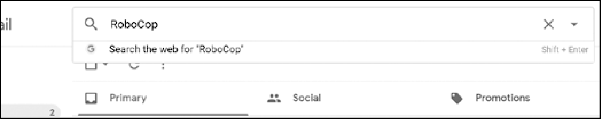

### 18.1.4　从Gmail账户中搜索邮件

除了使用 `ezgmail.unread()` 和 `ezgmail.recent()` ，你还可以通过调用  `ezgmail. search()` 来搜索特定的邮件，就像你在邮箱的搜索框中查询一样：

```javascript
>>> resultThreads = ezgmail.search('RoboCop')
>>> len(resultThreads)
1
>>> ezgmail.summary(resultThreads)
Al, Jon - Do you want to watch RoboCop this weekend? - Dec 09
```

前面的 `search()` 调用得到的结果，应该与在搜索框中输入“RoboCop”相同，如图18-1所示。


<center class="my_markdown"><b class="my_markdown">图18-1　在Gmail网站上搜索“RoboCop”邮件</b></center>

和 `unread()` 和 `recent()` 一样， `search()` 函数也会返回一个 `GmailThread` 对象的列表。你也可以将任何一个可以输入搜索框中的特殊搜索操作符传递给 `search()` 函数，如下面这些。

`'label:UNREAD'` 用于未读邮件。

`'from:al@inventwithpython.com'` 用于来自 al@inventwithpython.com 的邮件。

`'subject:hello'` 用于主题中包含hello的邮件。

`'has:attachment'` 用于有附件的邮件。

可以在Google的支持页面找到完整的搜索操作符列表。

