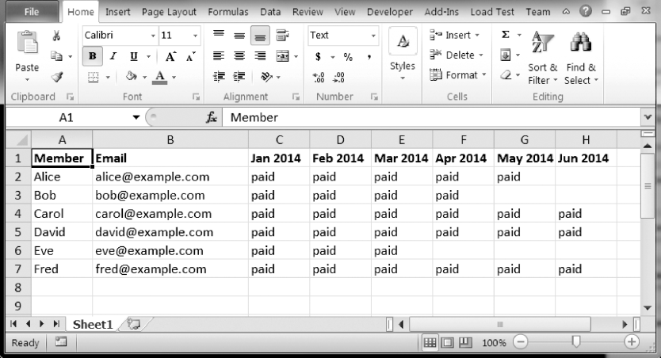

### 第1步：打开Excel文件

假定用来记录会费支付的Excel电子表格看起来如图 18-2 所示，放在名为duesRecords.xlsx的文件中。可以从异步社区本书对应页面下载该文件。

该电子表格中包含每个成员的姓名和电子邮件地址。每个月有一列，用来记录会员的付款状态。在成员支付会费后，对应的单元格就记为paid。

该程序必须打开duesRecords.xlsx，通过读取sheet.max_column属性，弄清楚最近一个月的列（可以参考第13章，了解用 `openpyxl` 模块访问Excel电子表格文件单元格的更多信息）。在文件编辑器窗口中输入以下代码：

```javascript
   #! python3
   # sendDuesReminders.py - Sends emails based on payment status in spreadsheet.
   import openpyxl, smtplib, sys
   # Open the spreadsheet and get the latest dues status.
❶ wb  =  openpyxl.load_workbook('duesRecords.xlsx')
❷ sheet = wb.get_sheet_by_name('Sheet1')
❸ lastCol = sheet.max_column
❹ latestMonth = sheet.cell(row=1, column=lastCol).value
   # TODO: Check each member's payment status.
   # TODO: Log in to email account.
   # TODO: Send out reminder emails.
```


<center class="my_markdown"><b class="my_markdown">图18-2 记录会员会费支付的电子表格</b></center>

导入 `openpyxl` 、 `smtplib` 和 `sys` 模块后，我们打开 `duesRecords.xlsx` 文件，将得到的 `Workbook` 对象保存在 `wb` 中❶。然后取得Sheet1，将得到的 `Worksheet` 对象保存在 `sheet` 中❷。既然有了 `Worksheet` 对象，就可以访问行、列和单元格了。我们将最后一列保存在 `lastCol` 中❸，然后用行号 `1` 和 `lastCol` 来访问应该记录着最近月份的单元格。取得该单元格的值，并将其保存在 `latestMonth` 中❹。

