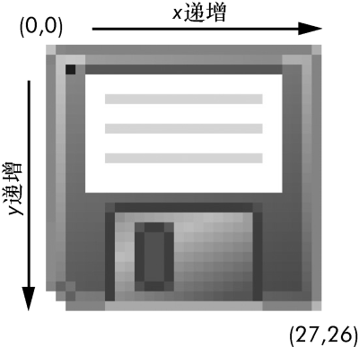
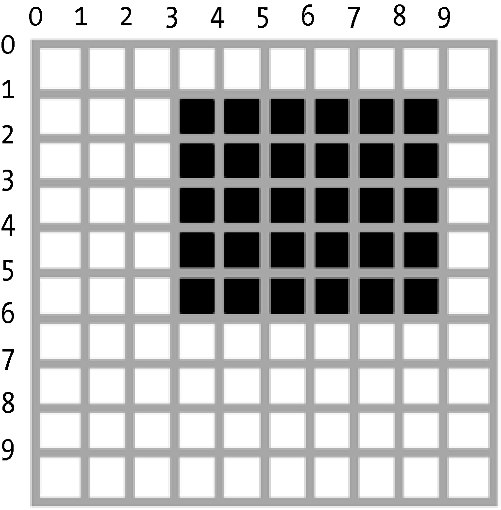

### 19.1.2　坐标和Box元组

图像像素用x和y坐标指定，它们分别指定像素在图像中的水平和垂直位置。原点是位于图像左上角的像素，用符号（0，0）指定。第一个0表示x坐标，它以原点处为0，从左至右增加。第二个0表示y坐标，它以原点处为0，从上至下增加。这值得重复一下：y坐标向下走为增加，你可能还记得数学课上使用的y坐标，与此相反。图19-1所示为这个坐标系统的工作方式。

<b class="my_markdown">图19-1　27像素×26像素的图像的x和y坐标，某种古老的数据存储装置</b>

`pillow` 中的许多函数和方法需要一个“矩形元组”参数。这意味着 `pillow` 需要一个4个整数坐标的元组，用于表示图像中的一个矩形区域。4个整数按顺序分别如下。

+ 左：该矩形的最左边的x坐标。
+ 顶：该矩形的顶边的y坐标。
+ 右：该矩形的最右边一个像素的x坐标。此整数必须比左边整数大。
+ 底：该矩形的底边一个像素的y坐标。此整数必须比顶边整数大。

注意，该矩形包括左和顶坐标，直到但不包括右和底坐标。例如，矩形元组（ `3, 1, 9, 6` ）表示图19-2所示的黑色矩形的所有像素。

<b class="my_markdown">图19-2　由矩形元组（3, 1, 9, 6）表示的区域</b>

