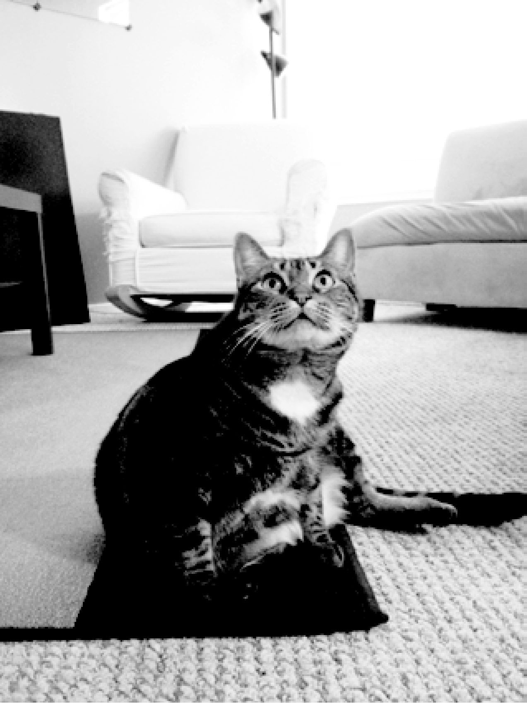

### 19.2　用pillow操作图像

既然知道了 `pillow` 中颜色和坐标的工作方式，就让我们用 `pillow` 来处理图像。图19-3所示的图像将用于本章中所有交互式环境的例子。你可以从异步社区本书对应页面中下载它。


<center class="my_markdown"><b class="my_markdown">图19-3　我的猫Zophie。照片上看起来增加了10磅（对猫来说很多）</b></center>

将图像文件zophie.png放在当前工作目录中，你就可以将Zophie的图像加载到Python中，像这样：

```javascript
>>> from PIL import Image
>>> catIm = Image.open('zophie.png')
```

要加载图像，就从 `pillow` 导入 `Image` 模块，并调用 `Image.open()` ，传入图像的文件名。然后，可以将加载的图像保存在 `catIm` 这样的变量中。 `pillow` 的模块名称是 `PIL` ，这保持了老模块 `Python Imaging Library` 的向后兼容，这就是为什么必须执行 `from PIL import Image` ，而不是执行 `from Pillow import Image` 。由于 `pillow` 的创建者设计 `pillow` 模块的方式，你必须使用 `from PIL import Image` 形式的 `import` 语句，而不是简单地执行 `import PIL` 。

如果图像文件不在当前工作目录，就调用 `os.chdir()` 函数，将工作目录变为包含图像文件的文件夹：

```javascript
>>> import os
>>> os.chdir('C:\\folder_with_image_file')
```

`Image.open()` 函数的返回值是 `Image` 对象数据类型，它是 `pillow` 将图像表示为Python值的方法。可以调用 `Image.open()` 方法，传入文件名字符串，从一个图像文件（任何格式）加载一个 `Image` 对象。调用 `save()` 方法，对 `Image` 对象的所有更改都可以保存到图像文件中（也是任何格式）。所有的旋转、调整大小、裁剪、绘画和其他图像操作，都通过这个 `Image` 对象上的方法调用来完成。

为了让本章的例子更简短，我假定你已导入了 `pillow` 的 `Image` 模块，并将Zophie的图像保存在了变量 `catIm` 中。要确保zophie.png文件在当前工作目录中，让 `Image.open()` 函数能找到它。否则，必须在 `Image.open()` 的字符串参数中指定完整的绝对路径。

