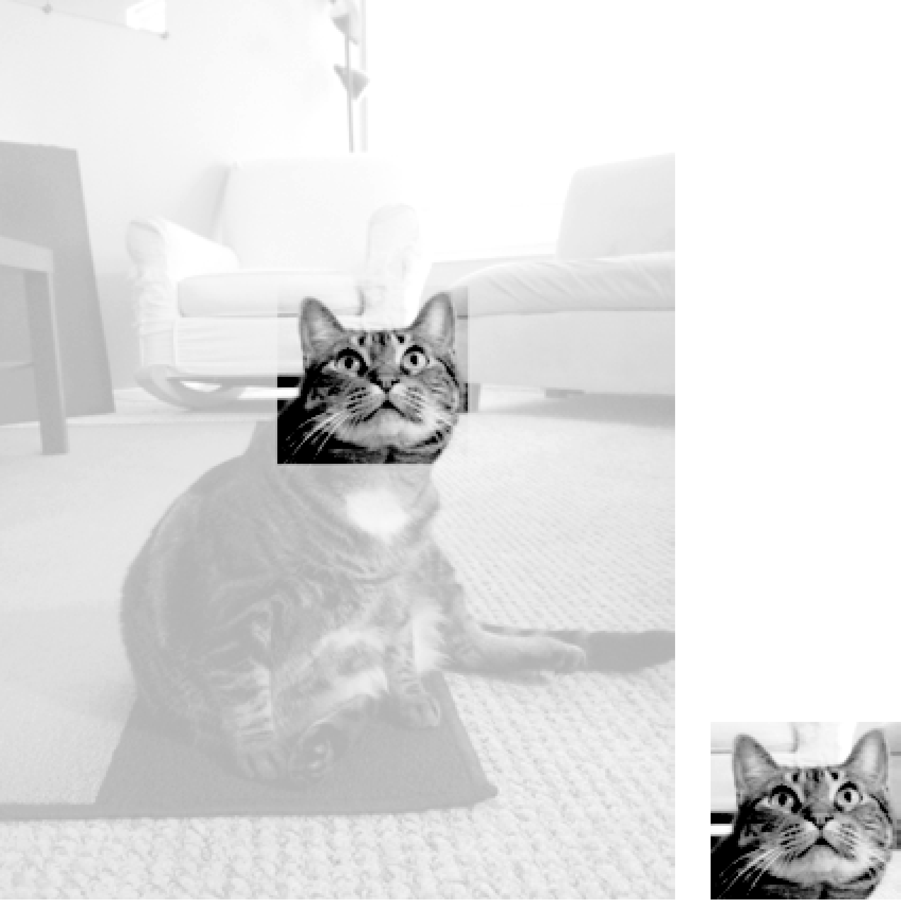

### 19.2.2　裁剪图像

“裁剪”图像是指在图像内选择一个矩形区域，并删除矩形之外的一切。 `Image` 对象的 `crop()` 方法接收一个矩形元组，并返回一个 `Image` 对象，以表示裁剪后的图像。裁剪不是在原图上发生的，也就是说，原始的 `Image` 对象原封不动， `crop()` 方法返回一个新的 `Image` 对象。请记住，矩形元组（这里就是要裁剪的区域）包括左列和顶行的像素，直至但不包括右列和底行的像素。

在交互式环境中输入以下代码：

```javascript
>>> from PIL import Image
>>> catIm = Image.open('zophie.png')
>>> croppedIm = catIm.crop((335, 345, 565, 560))
>>> croppedIm.save('cropped.png')
```

这将得到一个新的 `Image` 对象，它是裁剪后的图像，保存在 `croppedIm` 中。然后调用  `croppedIm`  的  `save()` ，将裁剪后的图像存入cropped.png。新文件cropped.png从原始图像创建，如图19-4所示。


<center class="my_markdown"><b class="my_markdown">图19-4　新图像只有原始图像裁剪后的部分</b></center>

