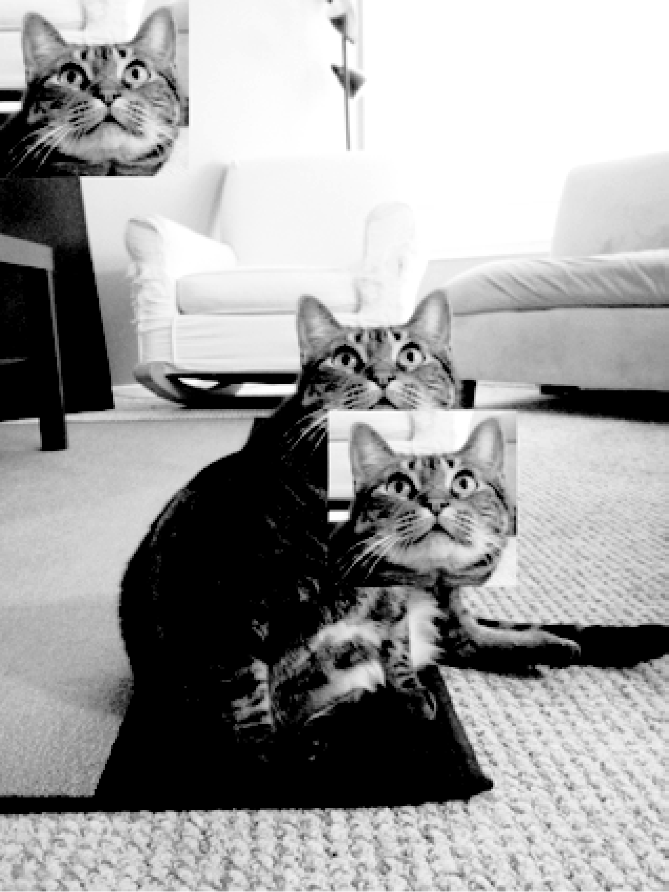
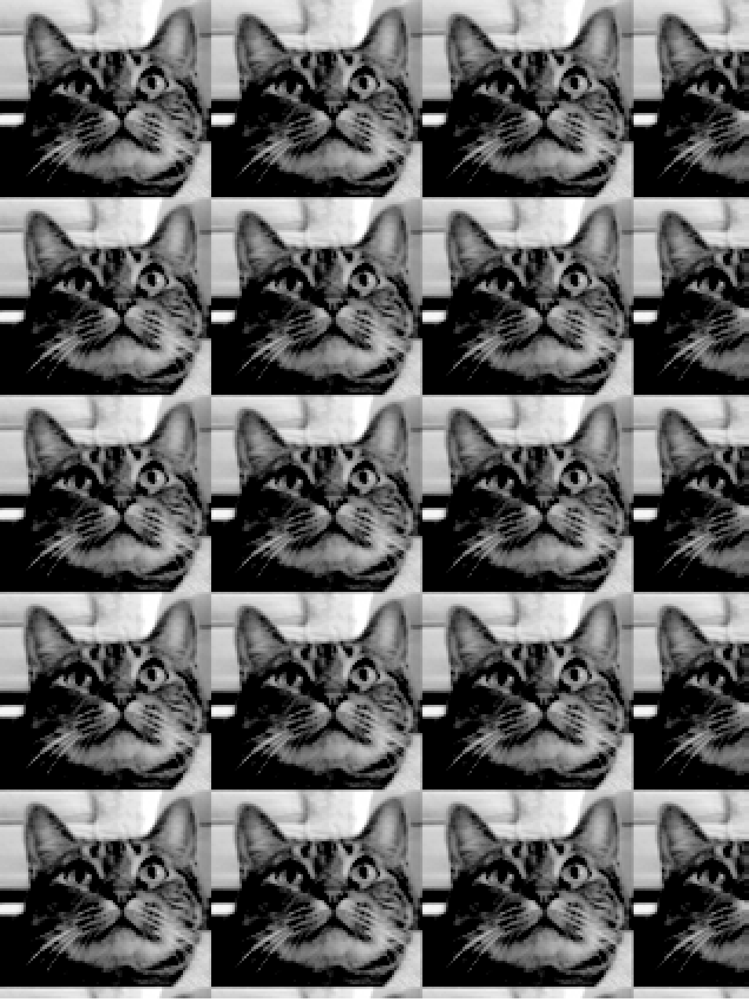

### 19.2.3　复制和粘贴图像到其他图像

`copy()` 方法返回一个新的 `Image` 对象，它和原来的 `Image` 对象具有一样的图像。如果需要修改图像，同时也希望保持原有的版本不变，该方法非常有用。例如，在交互式环境中输入以下代码：

```javascript
>>> from PIL import Image
>>> catIm = Image.open('zophie.png')
>>> catCopyIm = catIm.copy()
```

`catIm` 和 `catCopyIm` 变量包含了两个独立的 `Image` 对象，它们的图像相同。既然 `catCopyIm` 中保存了一个 `Image` 对象，那么你可以随意修改 `catCopyIm` ，将它存入一个新的文件名，而zophie.png没有改变。例如，让我们尝试用 `paste()` 方法修改 `catCopyIm` 。

`paste()` 方法在 `Image` 对象上调用，将另一个图像粘贴在它上面。我们继续演示交互式环境的例子，将一个较小的图像粘贴到 `catCopyIm` ：

```javascript
>>> faceIm = catIm.crop((335, 345, 565, 560))
>>> faceIm.size
(230, 215)
>>> catCopyIm.paste(faceIm, (0, 0))
>>> catCopyIm.paste(faceIm, (400, 500))
>>> catCopyIm.save('pasted.png')
```

首先我们向 `crop()` 传入一个矩形元组，指定zophie.png中的一个矩形区域，该区域包含Zophie的脸。这将创建一个 `Image` 对象，表示230像素×215像素的裁剪区域，被保存在 `faceIm` 中。现在，我们可以将 `faceIm` 粘贴到 `catCopyIm` 。 `paste()` 方法有两个参数：一个“源” `Image` 对象；一个包含x和y坐标的元组，指明源 `Image` 对象粘贴到主 `Image` 对象时左上角的位置。这里，我们在 `catCopyIm` 上两次调用 `paste()` ，第一次传入 `(0, 0)` ，第二次传入 `(400, 500)` 。这将 `faceIm` 两次粘贴到 `catCopyIm` ：一次 `faceIm` 的左上角在 `(0, 0)` ，一次 `faceIm` 的左上角在 `(400, 500)` 。最后，我们将修改后的 `catCopyIm` 存入pasted.png。图19-5所示为pasted.png。


<center class="my_markdown"><b class="my_markdown">图19-5　猫Zophie，包含两次粘贴它的脸</b></center>


**注意：**
尽管名称是 `copy()` 和 `paste()` ，但Pillow中的方法不使用计算机的剪贴板。


请注意， `paste()` 方法在原图上修改它的 `Image` 对象，它不会返回粘贴后图像的 `Image` 对象。如果想调用 `paste()` ，又要保持原始图像的未修改版本，就需要先复制图像，然后在副本上调用 `paste()` 。

假定要用Zophie的头平铺整个图像，如图19-6所示，可以用两个 `for` 循环来实现这个效果。继续交互式环境的例子，输入以下代码：


<center class="my_markdown"><b class="my_markdown">图19-6　嵌套的 `for` 循环与 `paste()` ，用于复制猫脸（可以称之为dupli-cat）</b></center>

```javascript
   >>> catImWidth, catImHeight = catIm.size
   >>> faceImWidth, faceImHeight = faceIm.size
❶  >>> catCopyTwo = catIm.copy()
❷  >>> for left in range(0, catImWidth, faceImWidth):
         ❸ for top in range(0, catImHeight, faceImHeight):
              print(left, top)
              catCopyTwo.paste(faceIm, (left, top))
   0 0
   0 215
   0 430
   0 645
   0 860
   0 1075
   230 0
   230 215
   --snip—
   690 860
   690 1075
   >>> catCopyTwo.save('tiled.png')
```

这里，我们将 `catIm` 的高度和宽度保存在 `catImWidth` 和 `catImHeight` 中。在❶行，我们得到了 `catIm` 的副本，并保存在 `catCopyTwo` 。既然有了一个副本可以粘贴，我们就开始循环，将 `faceIm` 粘贴到 `catCopyTwo` 。外层 `for` 循环的 `left` 变量从0开始，增量是 `faceImWidth` （即230）❷。内层 `for` 循环的 `top` 变量从0开始，增量是 `faceImHeight` （即215）❸。这些嵌套的 `for` 循环生成了 `left` 和 `top` 的值，将 `faceIm` 图像按照网格粘贴到 `Image` 对象 `catCopyTwo` ，如图19-6所示。为了看到嵌套循环的工作过程，我们输出了 `left` 和 `top` 。粘贴完成后，我们将修改后的 `catCopyTwo` 保存到tiled.png。

