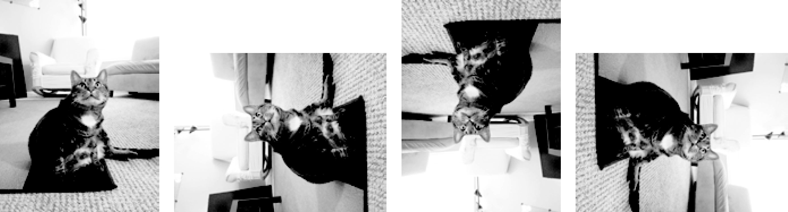
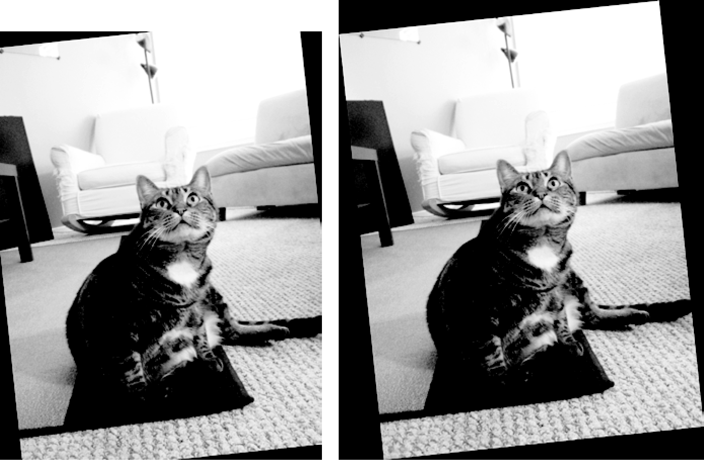
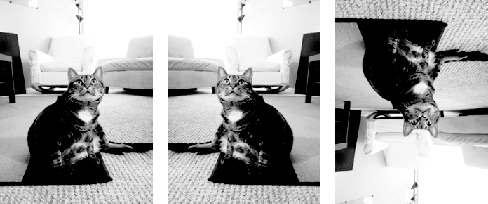

### 19.2.5　旋转和翻转图像

图像可以用 `rotate()` 方法旋转，该方法返回旋转后的新 `Image` 对象，并保持原始 `Image` 对象不变。 `rotate()` 的参数是一个整数或浮点数，表示图像逆时针旋转的度数。在交互式环境中输入以下代码：

```javascript
>>> from PIL import Image
>>> catIm = Image.open('zophie.png')
>>> catIm.rotate(90).save('rotated90.png')
>>> catIm.rotate(180).save('rotated180.png')
>>> catIm.rotate(270).save('rotated270.png')
```

注意，可以“链式”调用方法，对 `rotate()` 返回的 `Image` 对象直接调用 `save()` 。第一个 `rotate()` 和 `save()` 调用得到一个逆时针旋转90度的新 `Image` 对象，并将旋转后的图像存入rotated90.png。第二个和第三个调用做的事情一样，但旋转了180度和270度。结果如图19-7所示。


<center class="my_markdown"><b class="my_markdown">图19-7　原始图像（左）和逆时针旋转90度、180度和270度的图像</b></center>

注意，当图像旋转90度或270度时，宽度和高度会变化。如果旋转其他角度，图像会保持原始尺寸。在Windows操作系统上，使用黑色的背景来填补旋转造成的缝隙。在macOS上，使用透明的像素来填补缝隙。

`rotate()` 方法有一个可选的 `expand` 关键字参数，如果设置为 `True` ，就会放大图像的尺寸，以适应整个旋转后的新图像。例如，在交互式环境中输入以下代码：

```javascript
>>> catIm.rotate(6).save('rotated6.png')
>>> catIm.rotate(6, expand=True).save('rotated6_expanded.png')
```

第一次调用将图像旋转6度，并存入rotate.png（参见图19-8所示的左边的图像）。第二次调用将图像旋转6度， `expand` 设置为 `True` ，并存入rotate6_expanded.png（如图19-8所示的右侧的图像）。


<center class="my_markdown"><b class="my_markdown">图19-8　图像普通旋转6度（左），以及使用expand=True（右）</b></center>

利用 `transpose()` 方法，还可以将图像“镜像翻转”。必须向 `transpose()` 方法传入 `Image.FLIP_LEFT_RIGHT` 或 `Image.FLIP_TOP_BOTTOM` 。在交互式环境中输入以下代码：

```javascript
>>> catIm.transpose(Image.FLIP_LEFT_RIGHT).save('horizontal_flip.png')
>>> catIm.transpose(Image.FLIP_TOP_BOTTOM).save('vertical_flip.png')
```

像 `rotate()` 一样， `transpose()` 会创建一个新 `Image` 对象。这里我们传入 `Image.FLIP_ LEFT_RIGHT` ，让图像水平翻转，然后存入horizontal_flip.png。要垂直翻转图像，请传入 `Image.FLIP_TOP_BOTTOM` ，并存入vertical_flip.png。结果如图19-9所示。


<center class="my_markdown"><b class="my_markdown">图19-9　原始图像（左），水平翻转（中），垂直翻转（右）</b></center>

