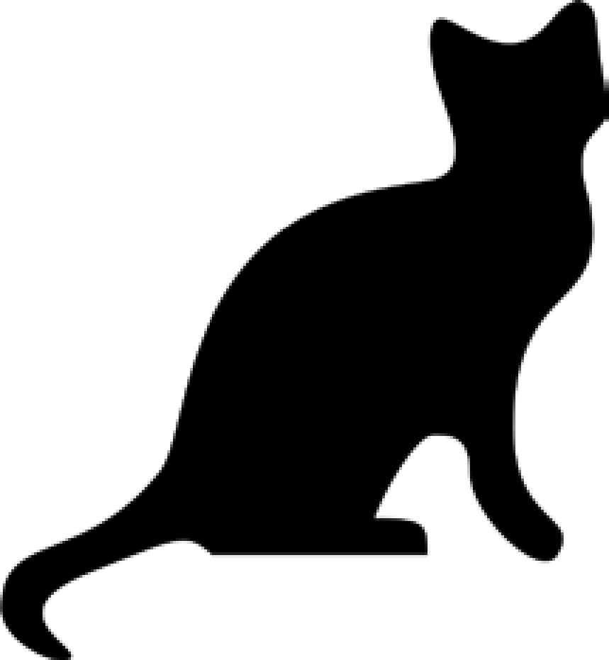

### 19.3　项目：添加徽标

假设你有一项无聊的工作，要调整数千张图片的大小，并在每张图片的角上增加一个小徽标水印。使用基本的图形程序，如Paintbrush或Paint，完成这项工作需要很长时间。像Photoshop这样的应用程序可以批量处理，但这个软件要花几百美元。让我们写一个脚本来完成工作。

假定图19-11所示是要添加到每个图像右下角的标识：带有白色边框的黑猫图标，图像的其余部分是透明的。

<b class="my_markdown">图19-11　添加到图像中的徽标</b>

总的来说，程序应该完成以下任务。

+ 载入徽标图像。
+ 循环遍历工作目标中的所有.png和.jpg文件。
+ 检查图片是否宽于或高于300像素。
+ 如果是，将宽度或高度中较大的一个减小为300像素，并按比例缩小另一维度。
+ 在角上粘贴徽标图像。
+ 将改变的图像存入另一个文件夹。

这意味着代码需要执行以下操作。

+ 打开catlogo.png文件将其作为 `Image` 对象。
+ 循环遍历 `os.listdir('.')` 返回的字符串。
+ 通过 `size` 属性取得图像的宽度和高度。
+ 计算调整后图像的新高度和宽度。
+ 调用 `resize()` 方法来调整图像大小。
+ 调用 `paste()` 方法来粘贴徽标。
+ 调用 `save()` 方法保存更改，使用原来的文件名。

